# t_u

 

 

 

 

 

 

 

 

 
KAN_Lv3 no overlapping data

 

 

 

 
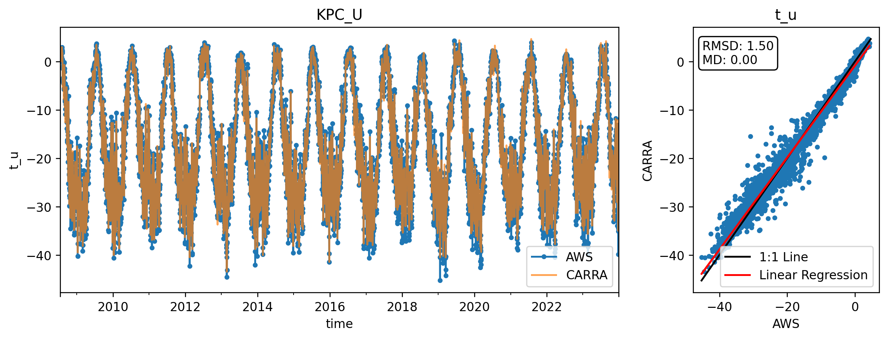
 

 

 

 

 

 
error
 

 

 
error
 

 

 
error
 

 
error
 

 
QAS_Mv3 no overlapping data

 

 

 

 

 

 
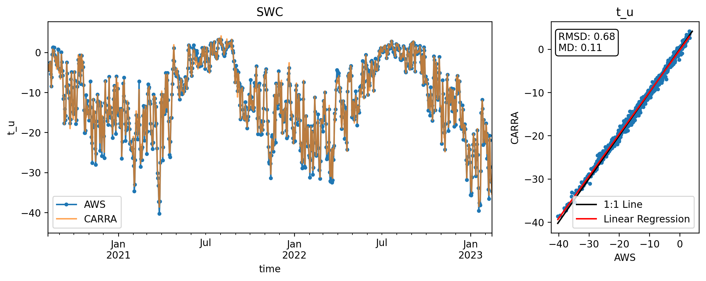
 

 

 

 
error
 

 

 

 

 

 

 

 
# rh_u

 

 

 

 

 

 

 

 

 
KAN_Lv3 no overlapping data

 

 

 

 

 

 

 

 
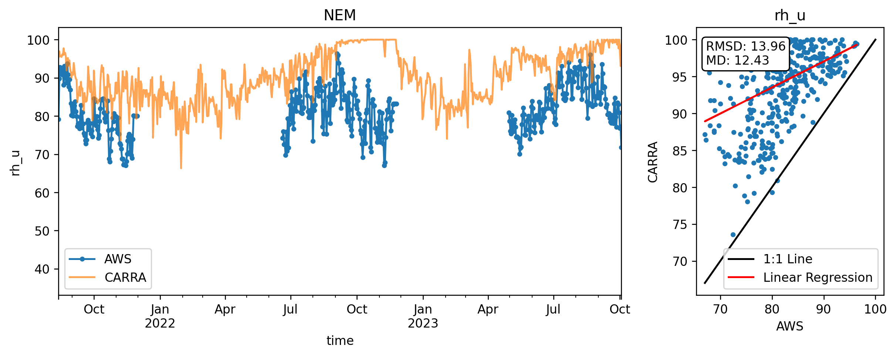
 

 
error
 

 

 
error
 

 

 
error
 
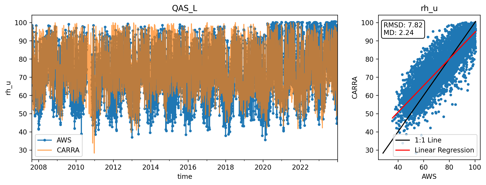
 
error
 

 
QAS_Mv3 no overlapping data

 

 

 

 

 
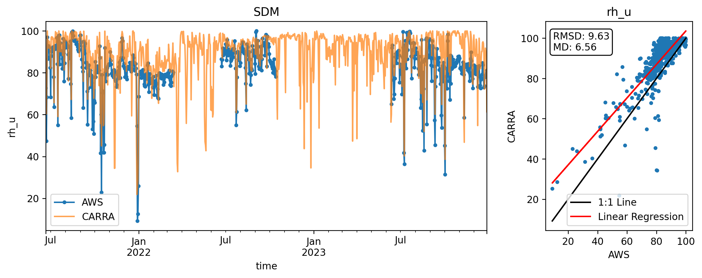
 

 

 

 

 
error
 

 

 

 

 

 

 

 
# rh_u_uncor

 

 

 

 

 

 

 

 

 
KAN_Lv3 no overlapping data

 

 

 

 

 

 

 

 

 

 
error
 

 

 
error
 

 

 
error
 

 
error
 

 
QAS_Mv3 no overlapping data

 

 

 

 

 

 

 

 

 

 
error
 

 

 

 

 

 

 

 
# p_u

 

 

 

 

 

 

 

 

 
KAN_Lv3 no overlapping data
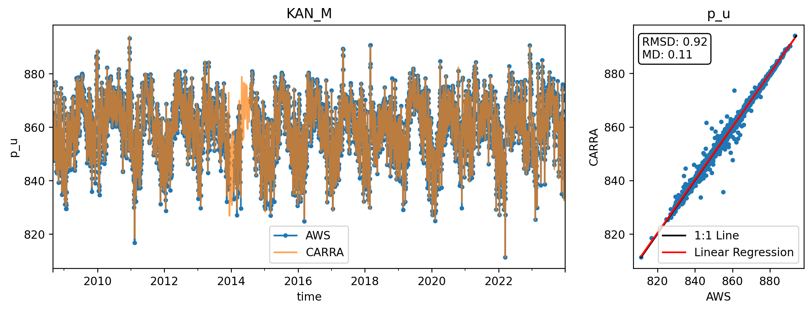
 

 

 

 

 

 
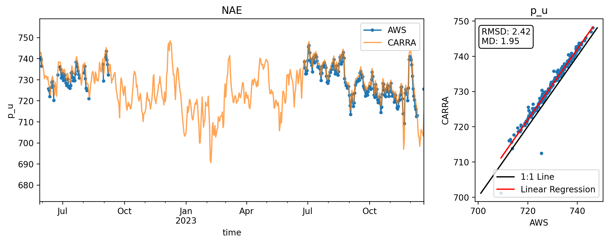
 

 

 

 
error
 

 

 
error
 
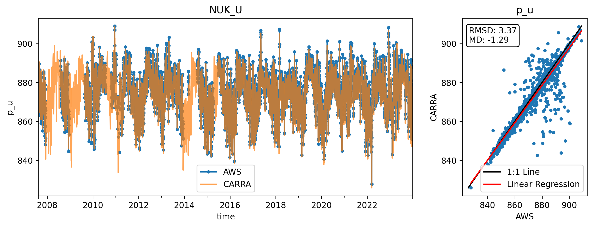
 

 
error
 

 
error
 

 
QAS_Mv3 no overlapping data

 

 

 

 

 

 

 

 

 

 
error
 

 

 

 

 

 

 

 
# wspd_u

 

 

 

 

 

 

 

 

 
KAN_Lv3 no overlapping data

 

 

 

 

 

 

 

 

 

 
error
 

 

 
error
 

 

 
error
 

 
error
 

 
QAS_Mv3 no overlapping data

 

 

 

 

 

 

 

 
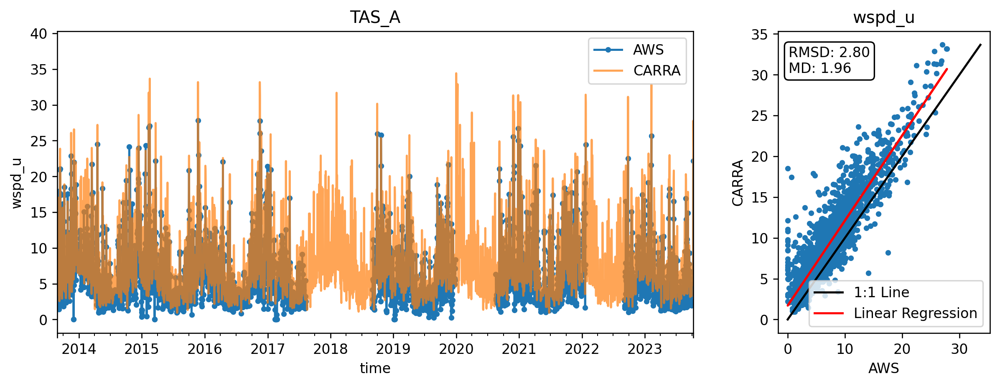
 

 
error
 

 

 

 

 

 

 

 
# dlr

 

 

 

 

 

 

 

 

 
KAN_Lv3 no overlapping data

 

 

 

 

 

 

 

 

 

 
error
 

 

 
error
 

 

 
error
 

 
error
 

 
QAS_Mv3 no overlapping data

 

 

 
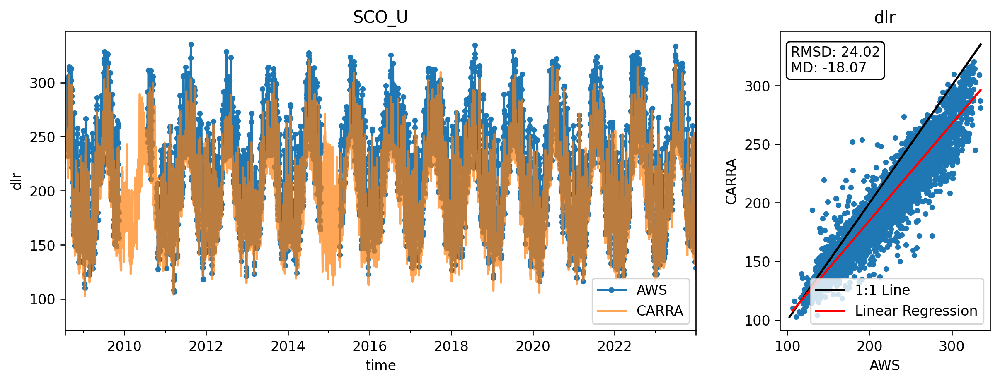
 

 
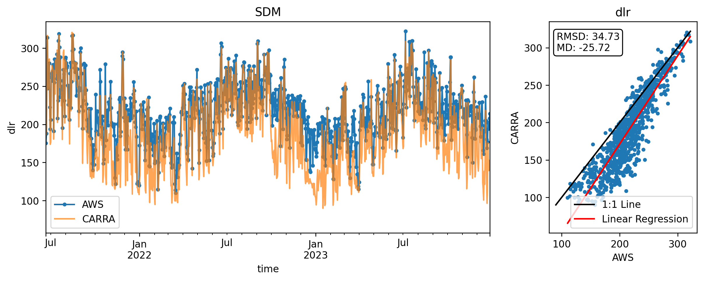
 

 

 

 

 
error
 

 

 

 

 

 

 

 
# ulr

 

 

 

 

 

 

 

 

 
KAN_Lv3 no overlapping data

 

 

 

 

 

 

 

 

 

 
error
 

 

 
error
 

 

 
error
 

 
error
 

 
QAS_Mv3 no overlapping data

 

 

 

 

 
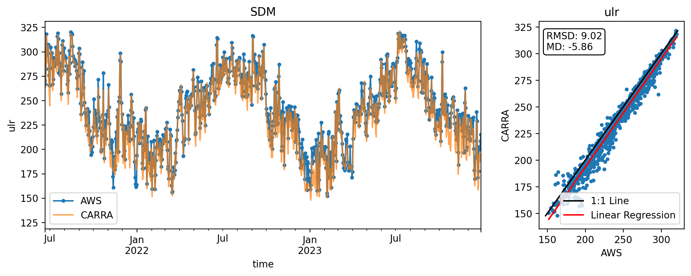
 

 

 

 

 
error
 

 

 

 
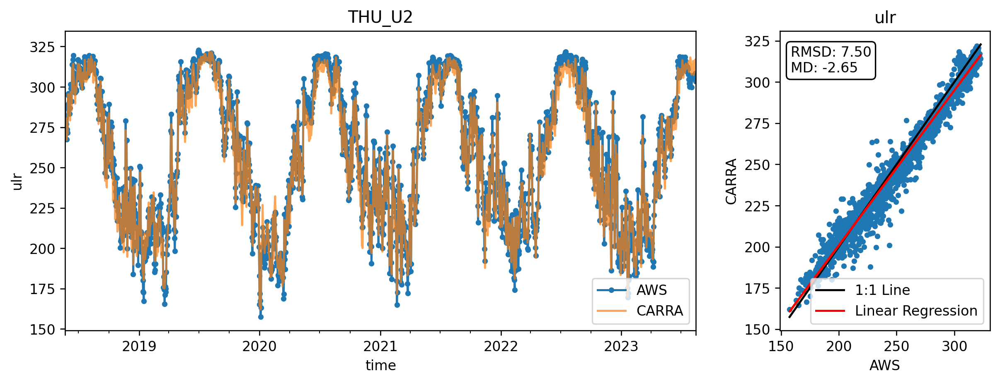
 

 

 

 
# t_surf

 

 

 

 

 

 

 

 

 
KAN_Lv3 no overlapping data

 

 

 

 

 

 

 
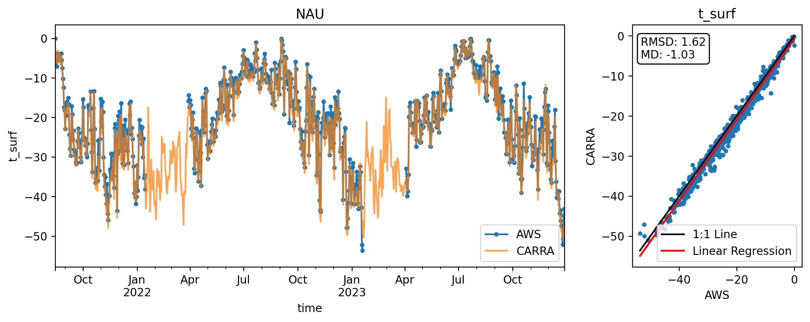
 

 

 
error
 

 

 
error
 

 

 
error
 

 
error
 

 
QAS_Mv3 no overlapping data
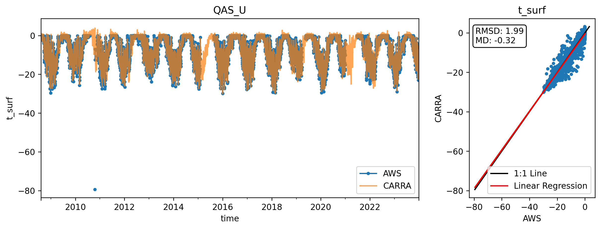
 

 

 

 

 

 

 

 

 

 
error
 

 

 

 

 

 

 

 
# albedo

 

 

 

 

 

 

 

 

 
KAN_Lv3 no overlapping data

 

 

 

 

 

 

 

 

 

 
error
 

 

 
error
 

 

 
error
 

 
error
 
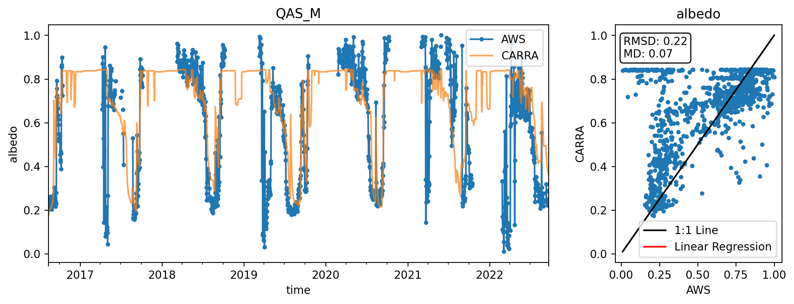
 
QAS_Mv3 no overlapping data

 

 

 

 

 

 

 

 

 
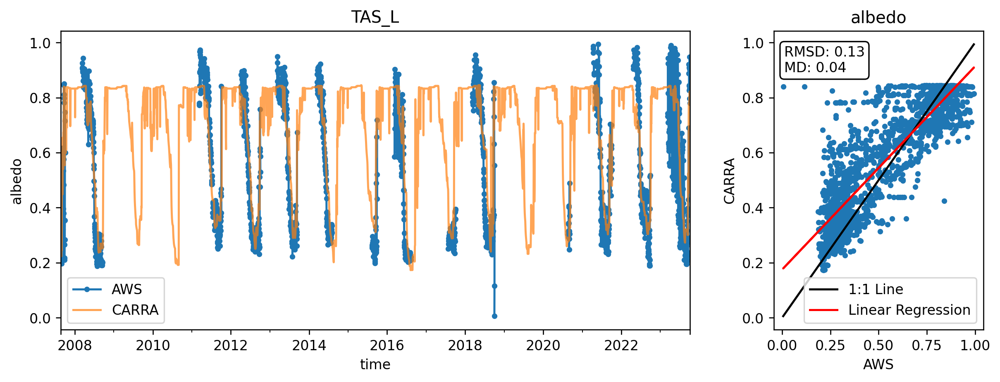
 
error
 

 

 

 

 

 

 

 
# dsr

 

 

 

 

 

 

 

 

 
KAN_Lv3 no overlapping data

 

 

 

 

 

 

 

 

 

 
error
 

 

 
error
 

 

 
error
 
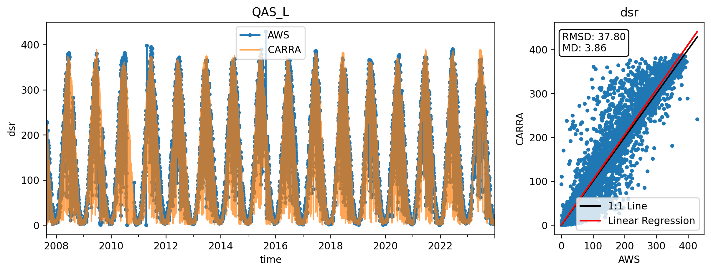
 
error
 

 
QAS_Mv3 no overlapping data

 

 

 

 

 

 

 

 

 

 
error
 

 

 

 

 

 

 

 
# dsr_uncor

 

 

 

 

 

 

 

 

 
KAN_Lv3 no overlapping data

 

 

 

 

 

 

 

 

 

 
error
 

 

 
error
 

 

 
error
 

 
error
 

 
QAS_Mv3 no overlapping data

 

 

 

 

 

 

 

 

 

 
error
 

 

 

 

 

 

 

 
# usr

 

 

 
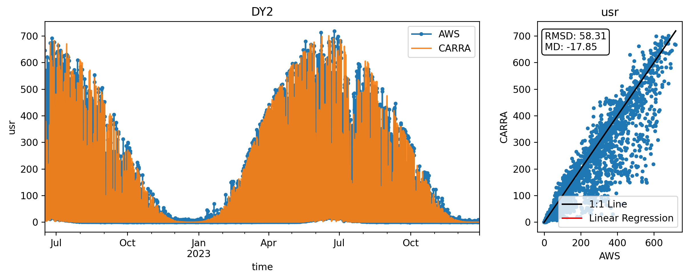
 

 

 

 

 
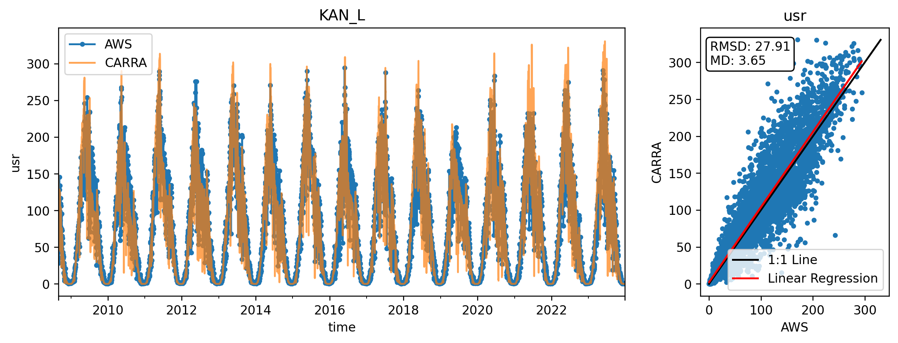
 
KAN_Lv3 no overlapping data

 

 

 

 
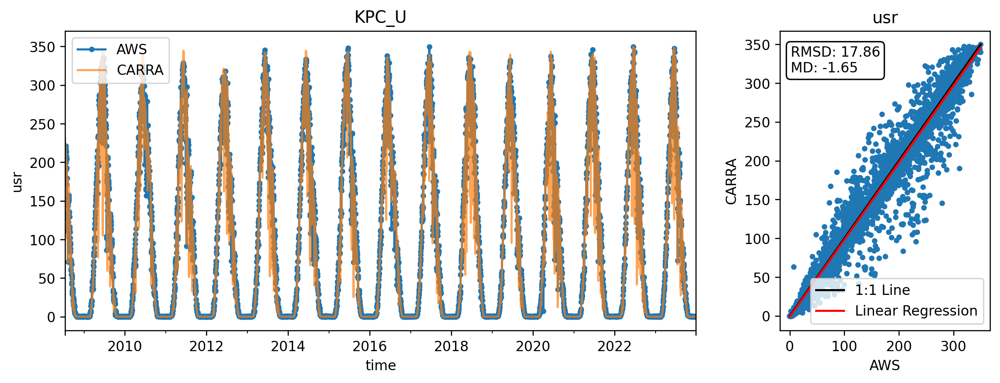
 

 

 

 

 

 
error
 

 

 
error
 

 

 
error
 

 
error
 

 
QAS_Mv3 no overlapping data

 

 

 

 

 

 

 
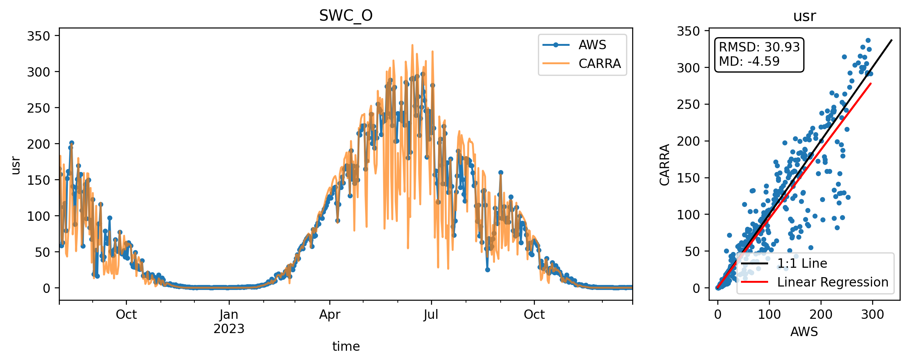
 

 

 
error
 

 

 

 

 

 
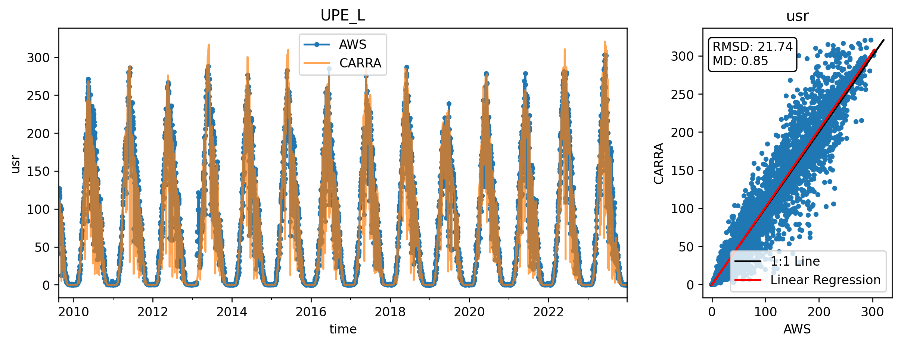
 

 
# usr_uncor

 

 

 

 

 

 

 

 

 
KAN_Lv3 no overlapping data

 

 

 

 

 

 

 

 

 

 
error
 

 

 
error
 

 

 
error
 

 
error
 

 
QAS_Mv3 no overlapping data

 

 

 

 

 

 

 

 

 

 
error
 

 

 

 

 

 

 

 
# dlhf_u

 

 

 
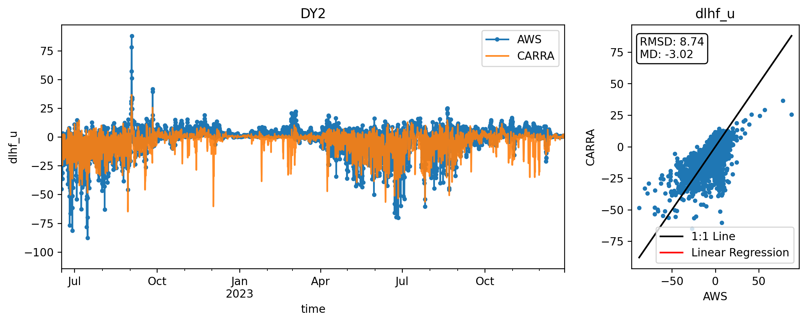
 

 
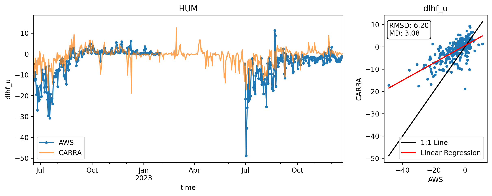
 

 

 

 
KAN_Lv3 no overlapping data

 

 

 

 
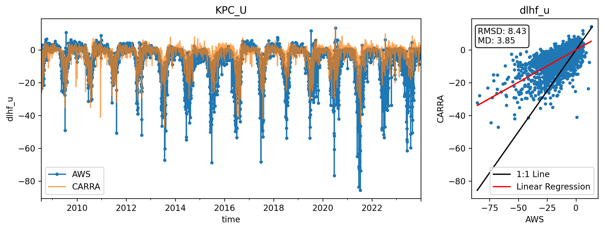
 

 

 
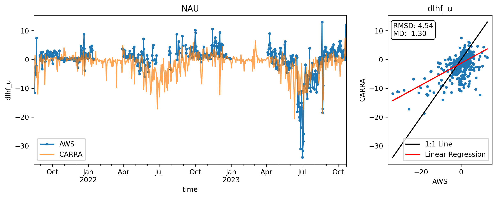
 

 

 
error
 

 

 
error
 

 

 
error
 

 
error
 

 
QAS_Mv3 no overlapping data

 

 

 
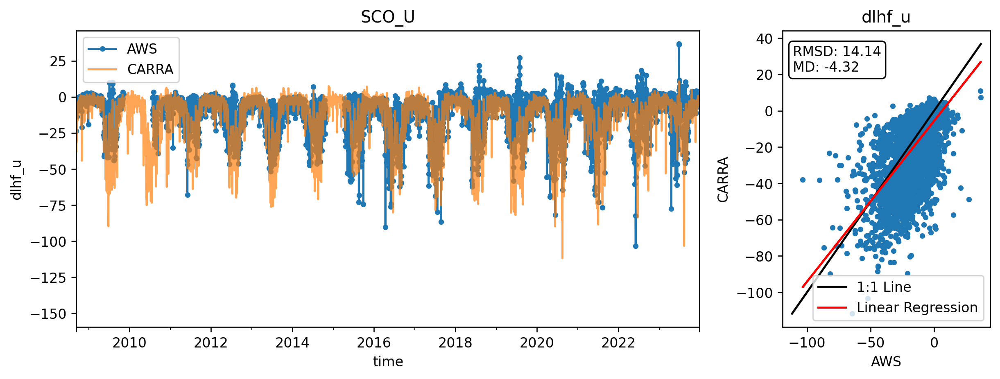
 
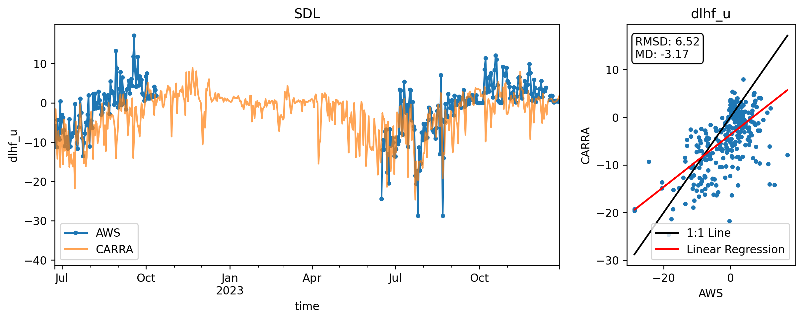
 

 

 

 

 

 
error
 

 

 

 

 

 

 

 
# dshf_u

 

 

 

 
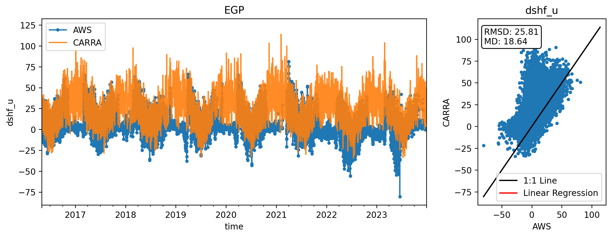
 

 

 

 

 
KAN_Lv3 no overlapping data

 

 

 

 

 

 

 

 

 

 
error
 

 

 
error
 
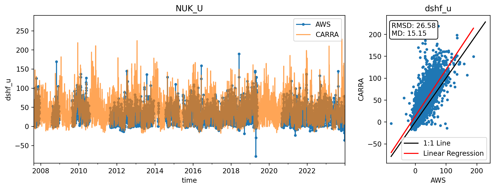
 

 
error
 
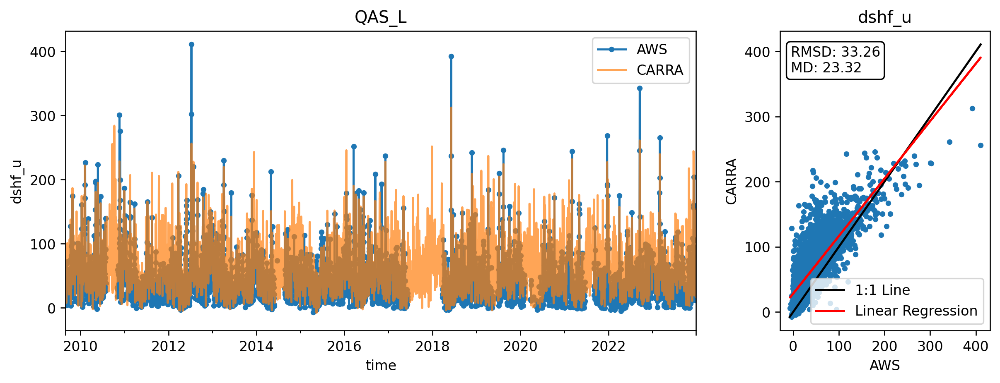
 
error
 
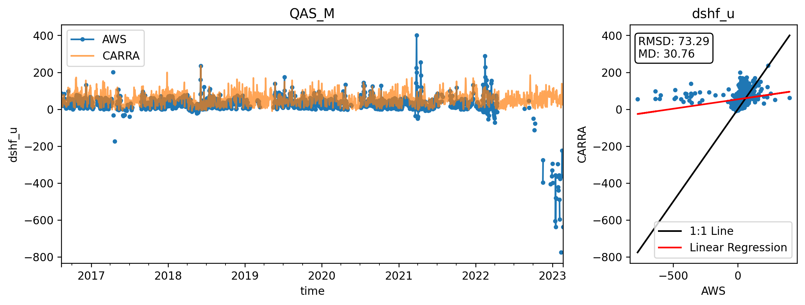
 
QAS_Mv3 no overlapping data

 

 

 

 

 

 

 

 

 

 
error
 

 

 

 

 

 

 

 
