# t_u

 
Skipping CEN2, already used in combination with CEN1

 

 

 
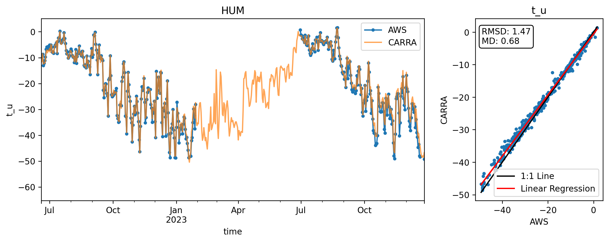
 

 

 

 

 

 

 
Skipping KPC_Lv3, already used in combination with KPC_L

 
Skipping KPC_Uv3, already used in combination with KPC_U

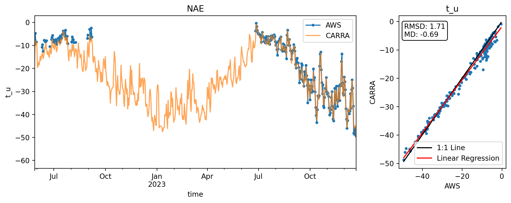
 

 

 

 

 

 

 
Skipping NUK_Uv3, already used in combination with NUK_U

 

 
Skipping QAS_Lv3, already used in combination with QAS_L

 

 
Skipping QAS_Uv3, already used in combination with QAS_U

 

 

 

 

 

 

 

 

 

 

 
error
 

 

 

 

 

 

 

 

 

 

 

 

 

 

 

 

 

 

 

 
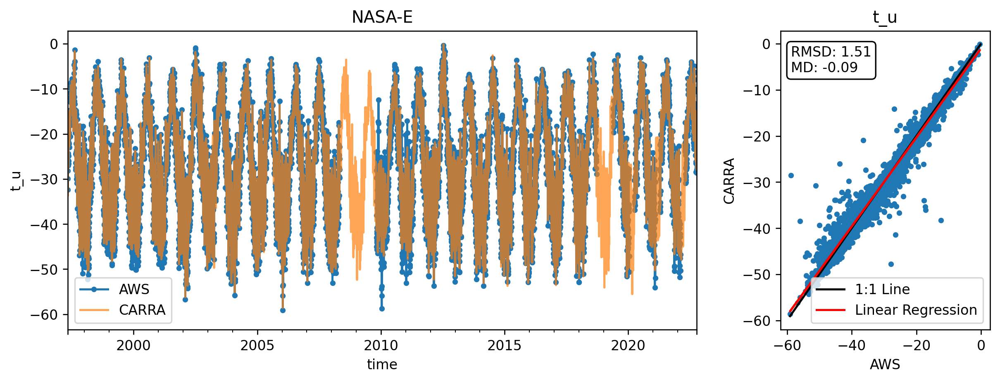
 

 

 

 

 

 

 

 
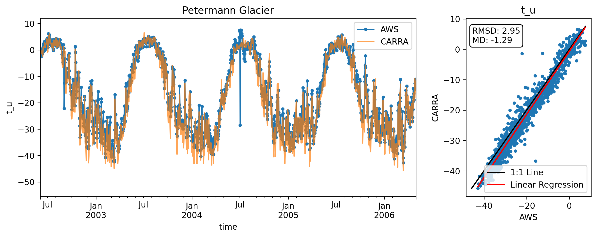
 

 

 

 

 

 
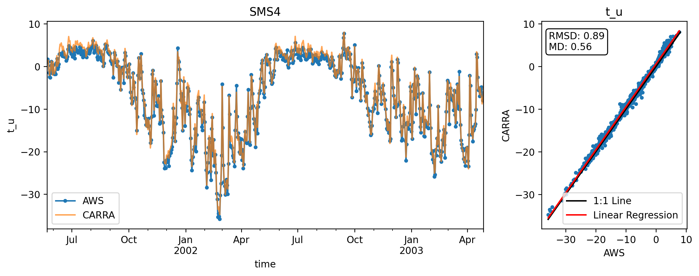
 

 
# rh_u

 
Skipping CEN2, already used in combination with CEN1

 

 

 

 

 

 
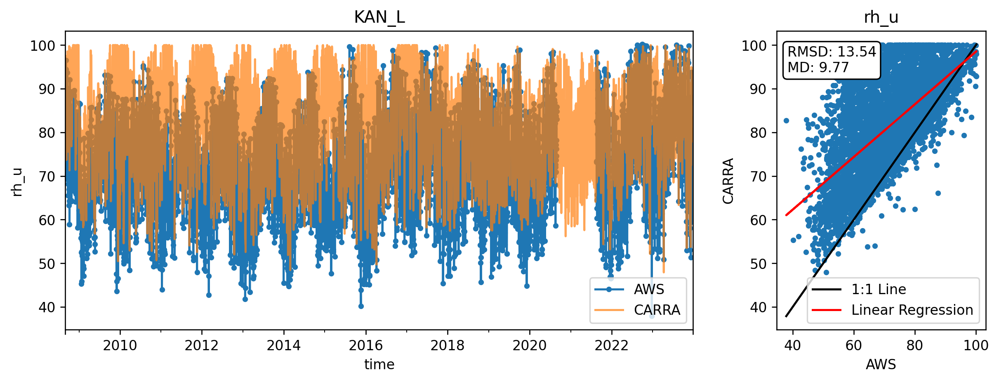
 
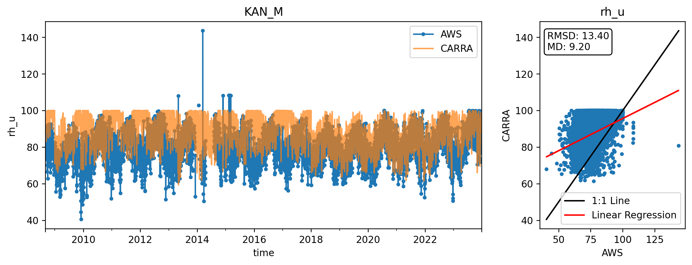
 
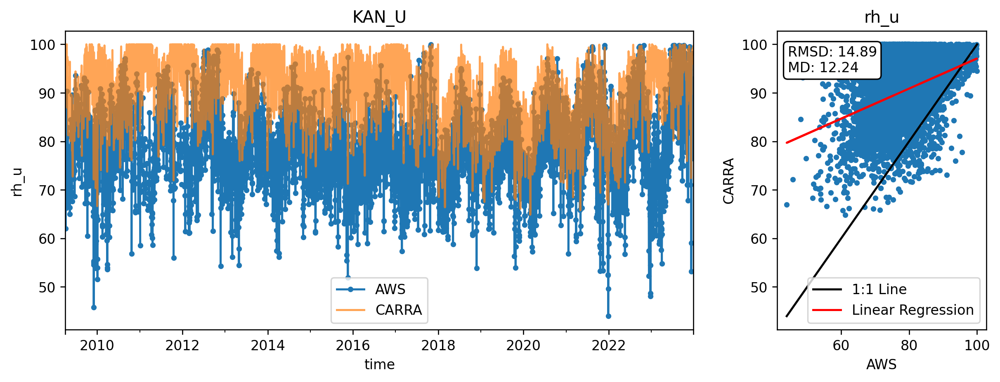
 

 
Skipping KPC_Lv3, already used in combination with KPC_L

 
Skipping KPC_Uv3, already used in combination with KPC_U

 
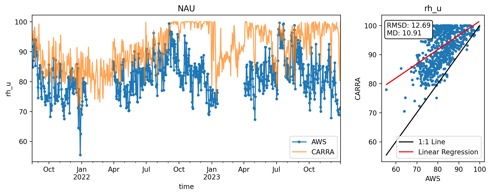
 

 
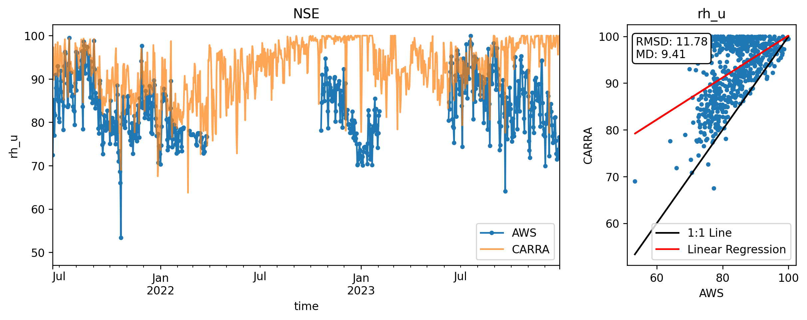
 

 

 

 
Skipping NUK_Uv3, already used in combination with NUK_U

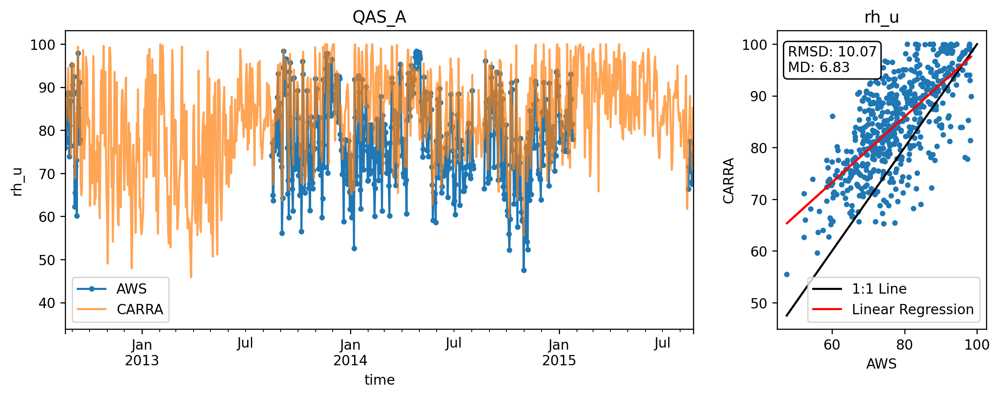
 

 
Skipping QAS_Lv3, already used in combination with QAS_L

 
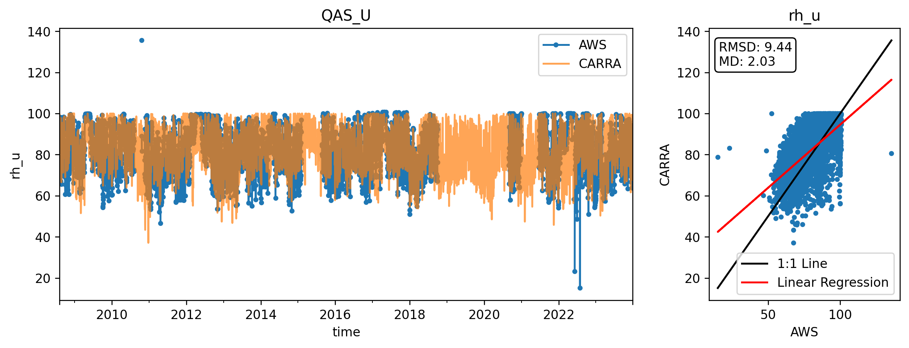
 
Skipping QAS_Uv3, already used in combination with QAS_U

 

 
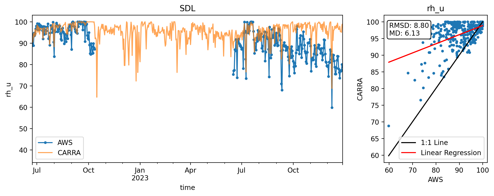
 

 

 

 

 

 

 

 

 
error
 

 
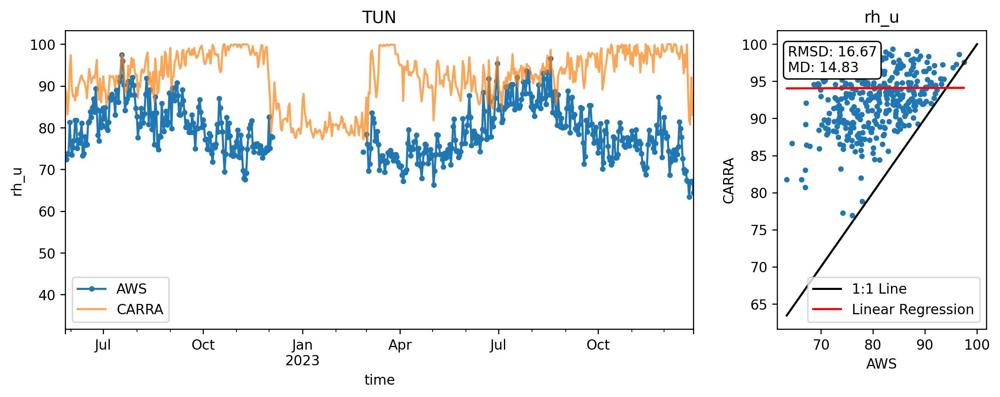
 

 
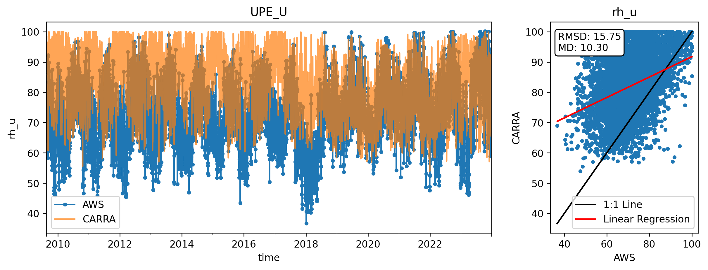
 
error
 
error
 
error
 
error
 
error
 
error
 
error
 
error
 
error
 
error
 
error
 
error
 
error
 
error
 
error
 
error
 
error
 
error
 
error
 
error
 
error
 
error
 
error
 
error
 
error
 
error
 
error
 
error
 
error
 
error
 
error
 
# rh_u_uncor

 
Skipping CEN2, already used in combination with CEN1

 

 

 

 
