# p_u

 

 
Skipping CEN2, already used in combination with CEN1

 

 

 

 

 

 
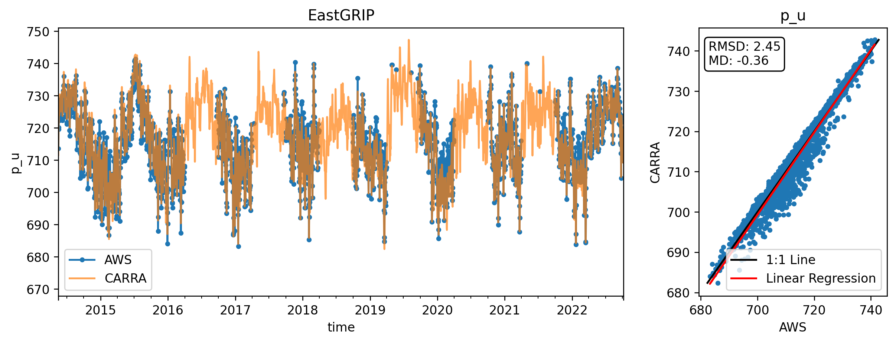
 
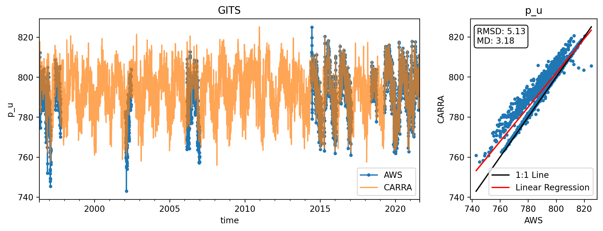
 

 
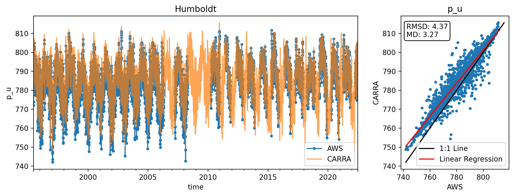
 

 

 

 
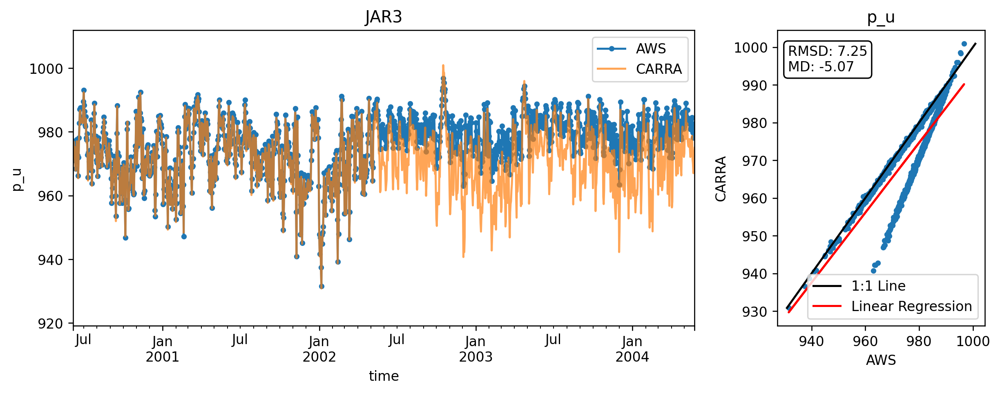
 

 

 

 

 

 

 
Skipping KPC_Lv3, already used in combination with KPC_L

 
Skipping KPC_Uv3, already used in combination with KPC_U

 

 
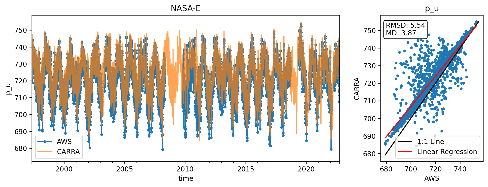
 

 
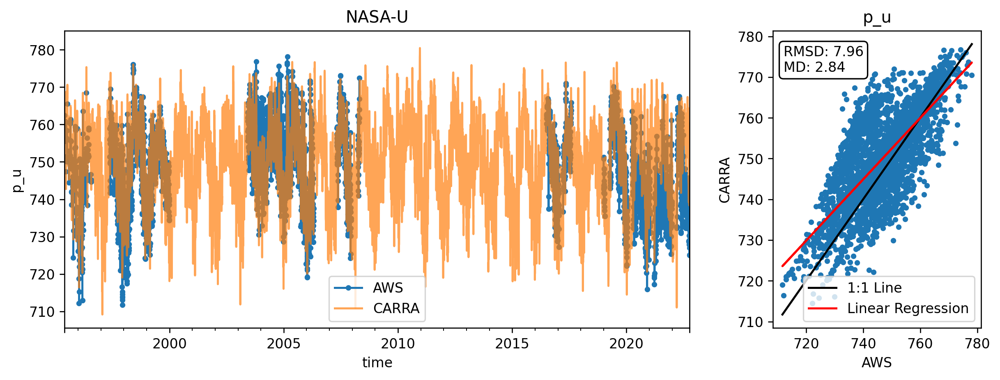
 

 

 

 

 

 

 

 

 
Skipping NUK_Uv3, already used in combination with NUK_U

 

 
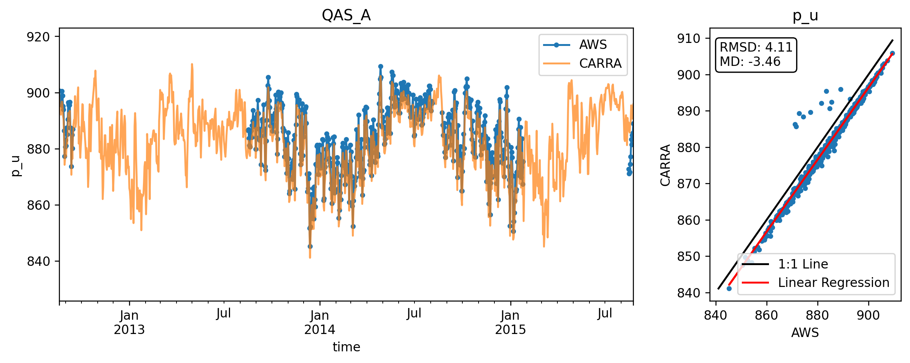
 

 
Skipping QAS_Lv3, already used in combination with QAS_L

 

 
Skipping QAS_Uv3, already used in combination with QAS_U

 

 

 

 

 
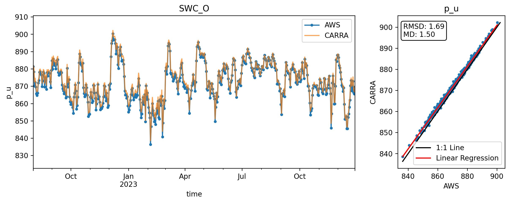
 

 

 

 
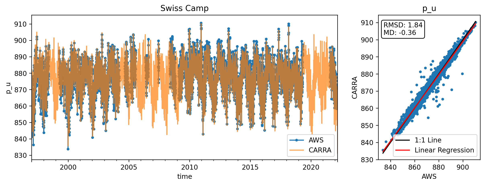
 
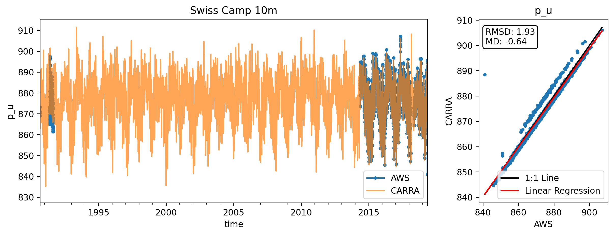
 

 

 

 

 

 

 

 

 

 
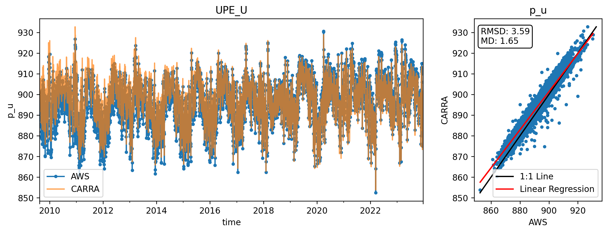
 
# wspd_u

 

 
Skipping CEN2, already used in combination with CEN1

 

 

 

 

 

 

 
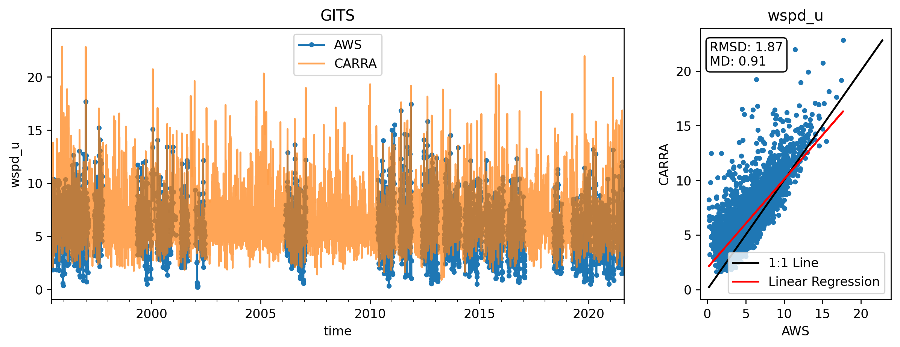
 

 

 

 

 

 

 

 

 

 

 
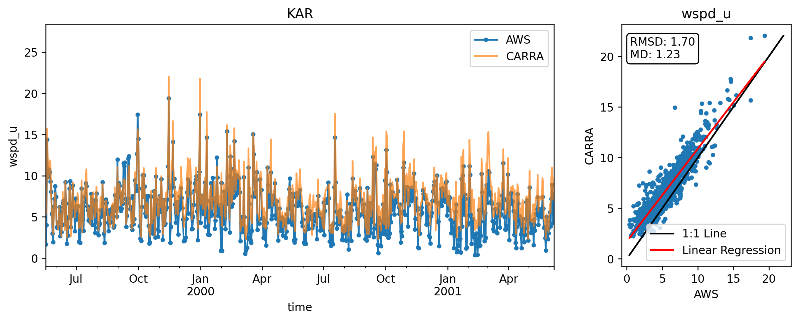
 

 
Skipping KPC_Lv3, already used in combination with KPC_L

 
Skipping KPC_Uv3, already used in combination with KPC_U

 

 

 

 

 

 
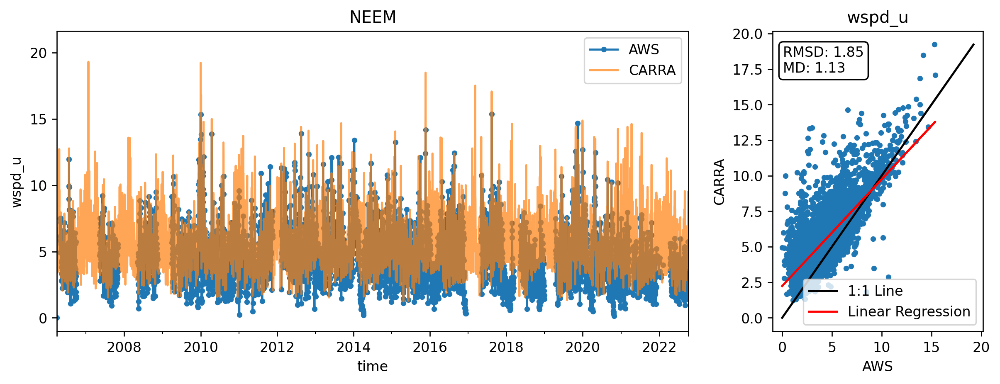
 
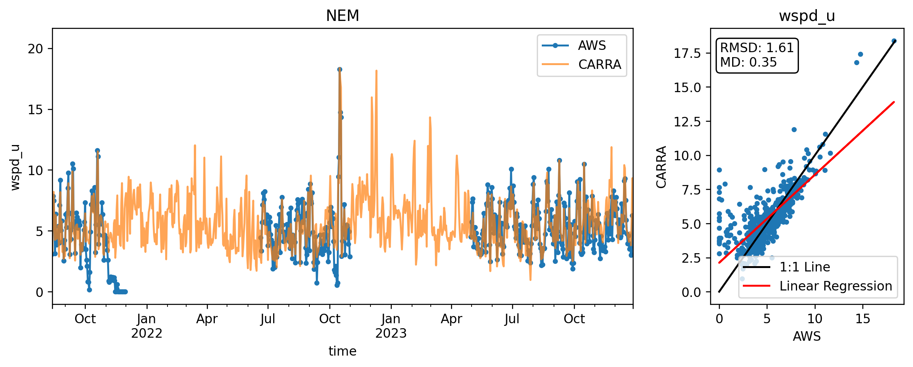
 

 

 

 

 

 
Skipping NUK_Uv3, already used in combination with NUK_U

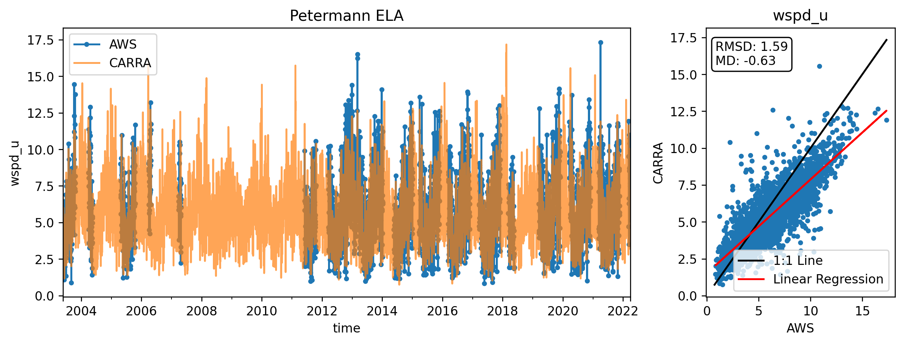
 
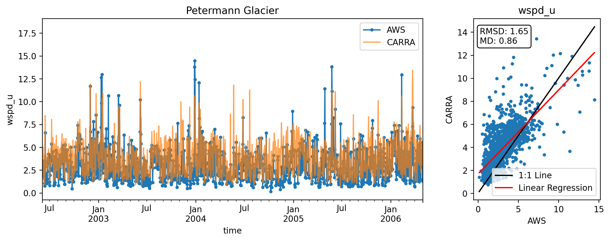
 
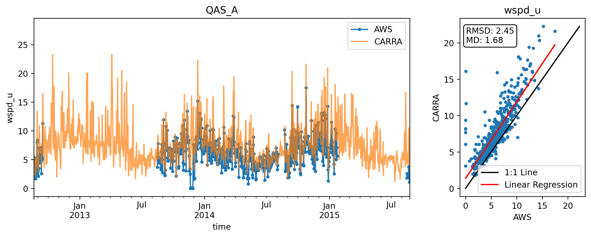
 

 
Skipping QAS_Lv3, already used in combination with QAS_L

 

 
Skipping QAS_Uv3, already used in combination with QAS_U

 

 

 

 
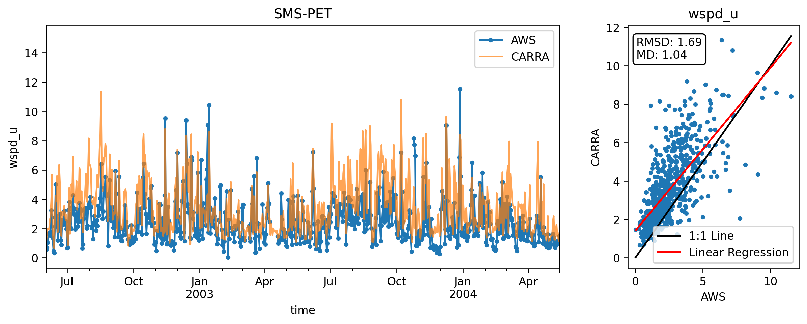
 
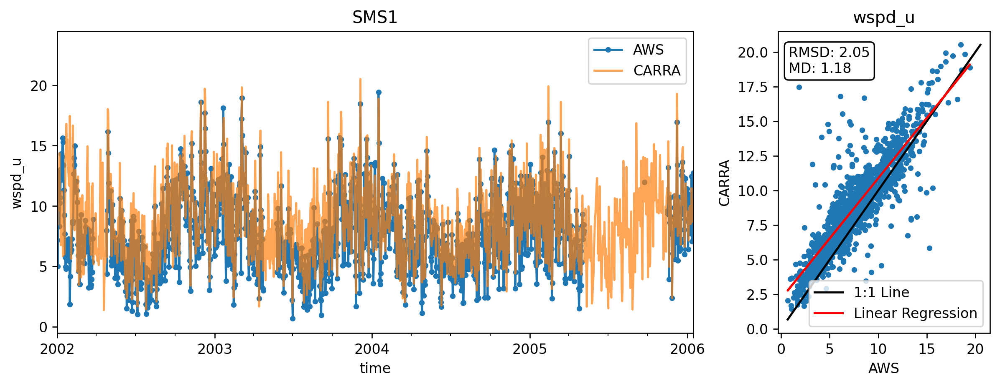
 

 

 

 

 

 

 

 

 

 

 

 

 

 
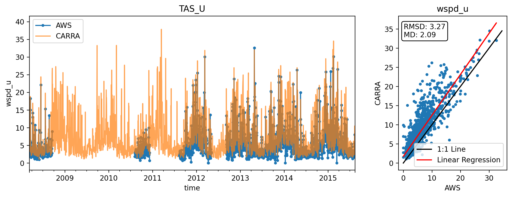
 

 

 

 
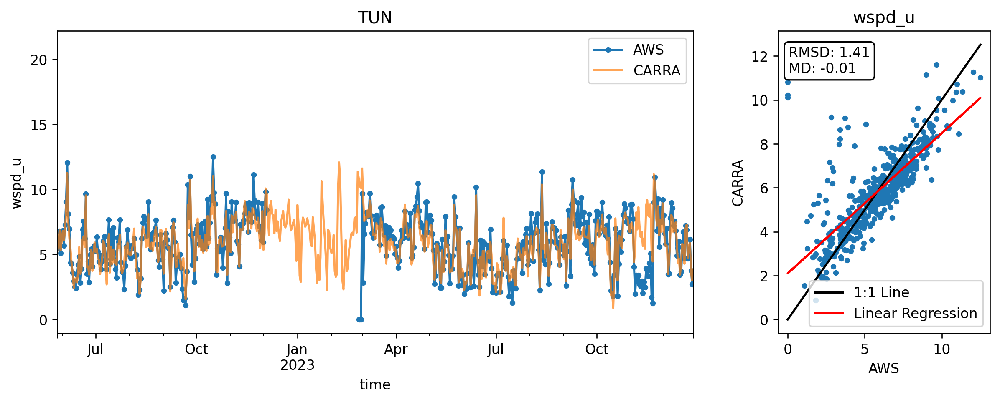
 

 

 

 
# dlr

 
Skipping CEN2, already used in combination with CEN1

 

 

 

 

 
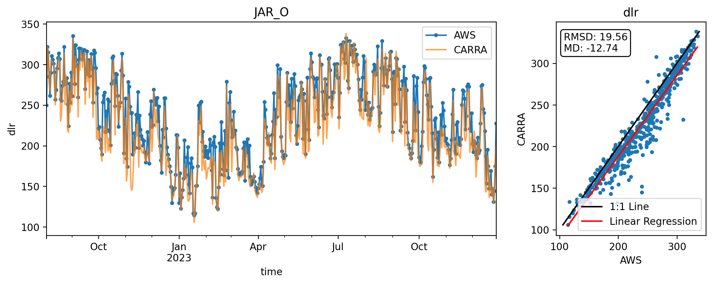
 

 

 

 

 
Skipping KPC_Lv3, already used in combination with KPC_L

 
Skipping KPC_Uv3, already used in combination with KPC_U

 

 

 

 

 

 

 
Skipping NUK_Uv3, already used in combination with NUK_U

 

 
Skipping QAS_Lv3, already used in combination with QAS_L

 

 
Skipping QAS_Uv3, already used in combination with QAS_U

 

 

 

 

 

 
