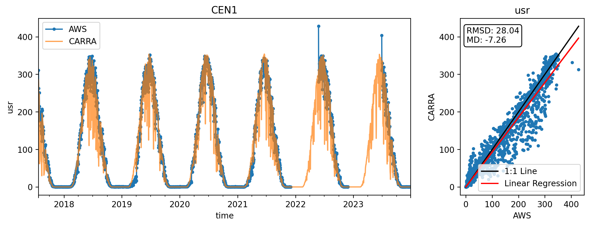
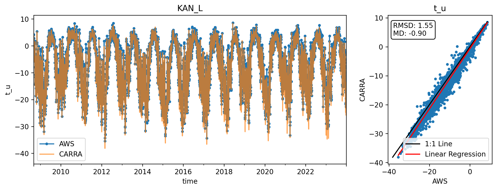
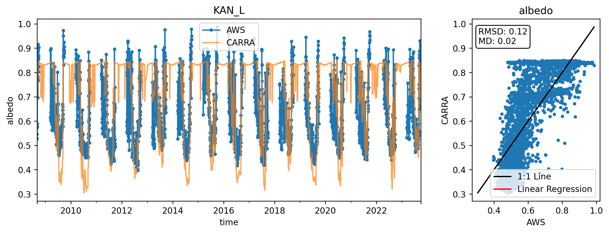
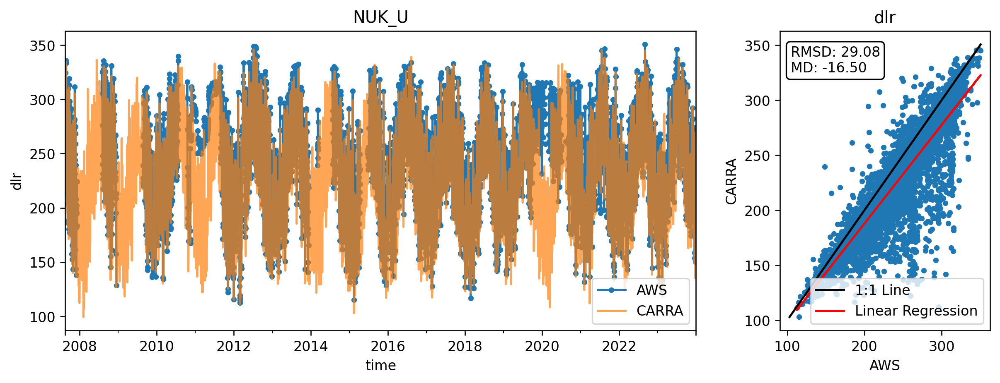
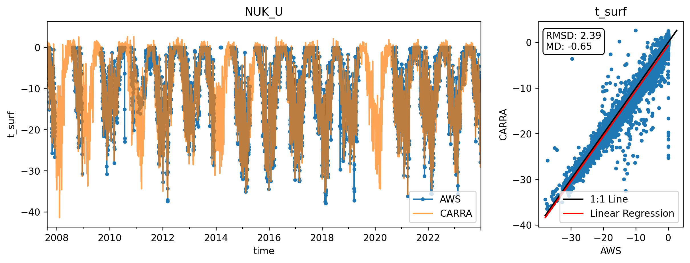
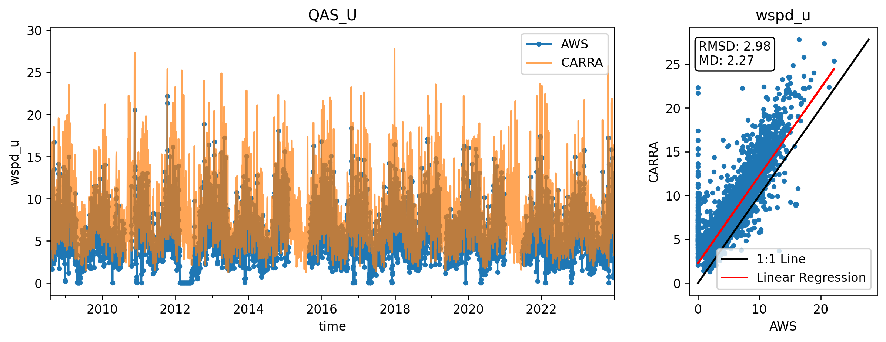
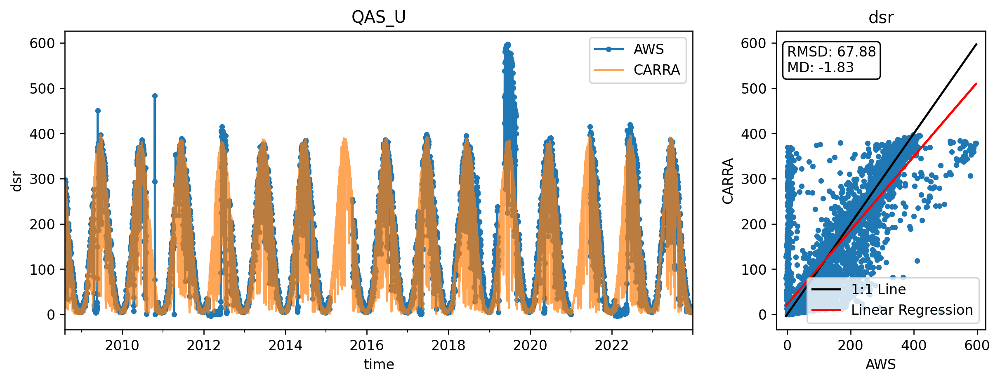
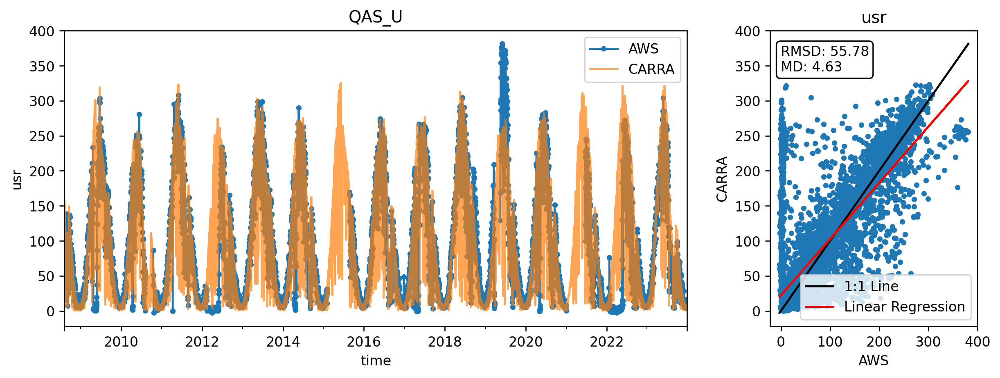

## CEN1
AWS altitude 1888.8

 
## JAR
AWS altitude 907.7

 
## KAN_B
AWS altitude 350.0

error
 
## KAN_L
AWS altitude 631.4

 
## KPC_L
AWS altitude 360.5

 
## KPC_U
AWS altitude 866.2

 
## KPC_Uv3
AWS altitude 866.0

 
## MIT
AWS altitude 430.2

 
## NUK_L
AWS altitude 490.5

 
## NUK_N
AWS altitude 920.0

error
 
## NUK_U
AWS altitude 1115.0

 
## QAS_A
AWS altitude 1000.0

error
 
## QAS_L
AWS altitude 236.9

 
## QAS_M
AWS altitude 678.0

 
## QAS_U
AWS altitude 885.1

 
## Roof_GEUS
AWS altitude 29.1

error
 
## Roof_PROMICE
AWS altitude 683.5

error
 
## SWC
AWS altitude 1120.0

 
## TAS_U
AWS altitude 570.0

error
 
## THU_U
AWS altitude 571.8

 
## UWN
AWS altitude 552.8

error
 
## WEG_L
AWS altitude 934.4

error
 
## ZAK_A
AWS altitude 1484.8

error
 
## ZAK_L
AWS altitude 685.7

 
## ZAK_U
AWS altitude 630.4

 
