# NSE
## dsr
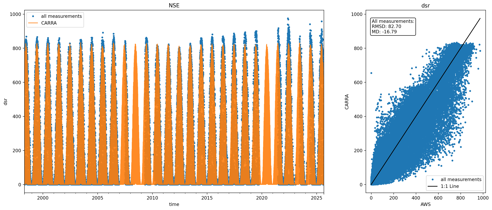
 
## usr
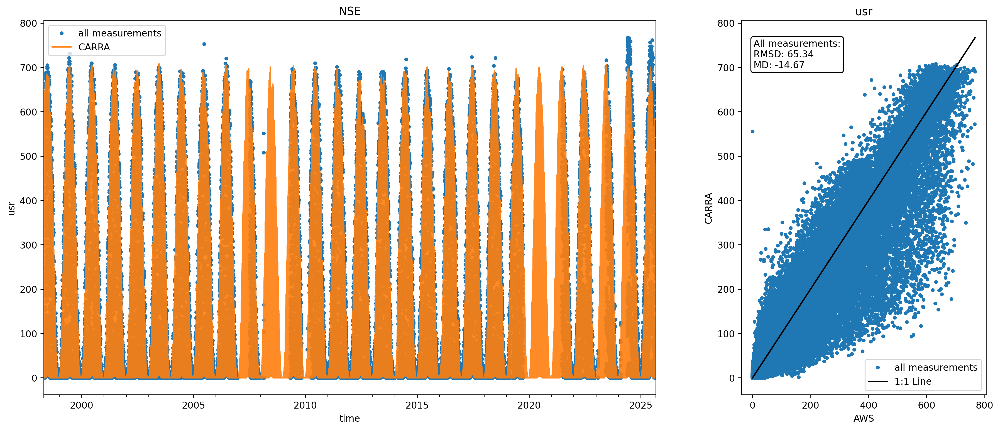
 
## albedo
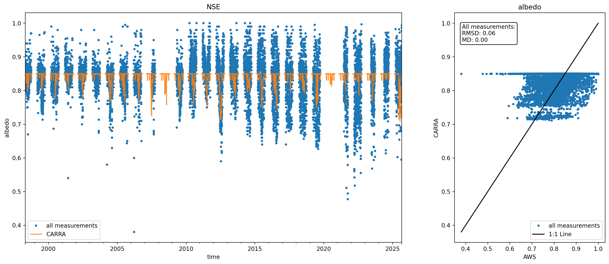
 
## dsr_cor
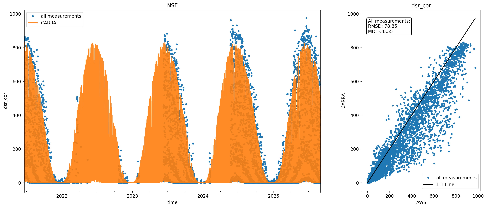
 
## usr_cor
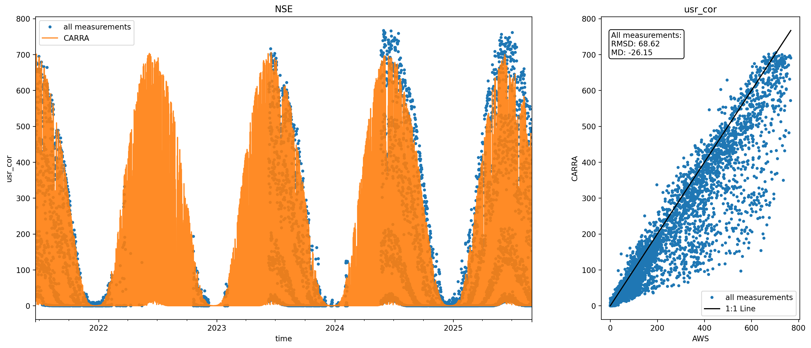
 
## dlhf_u
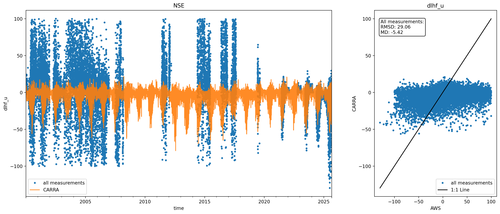
 
## dshf_u
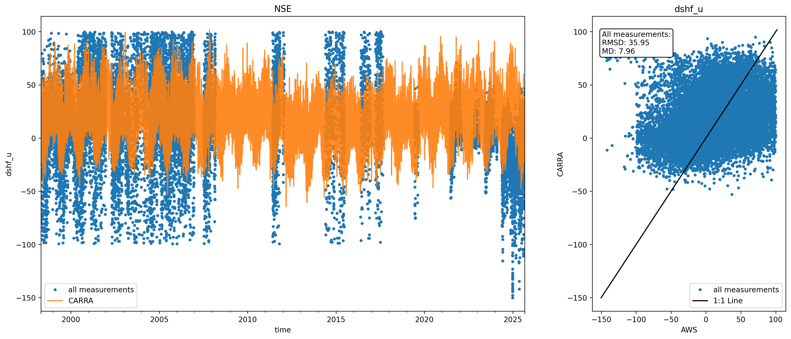
 
## t_u
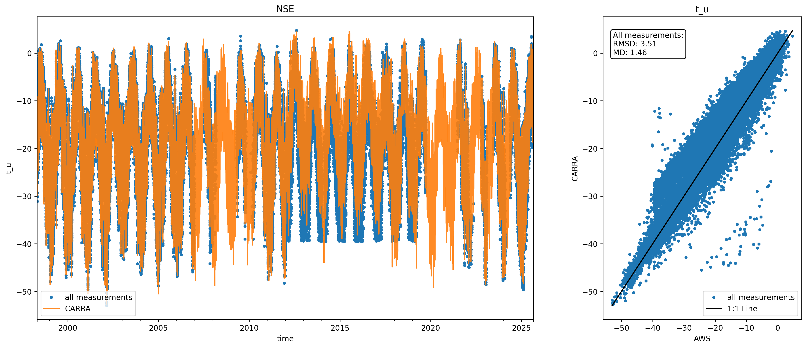
 
## rh_u
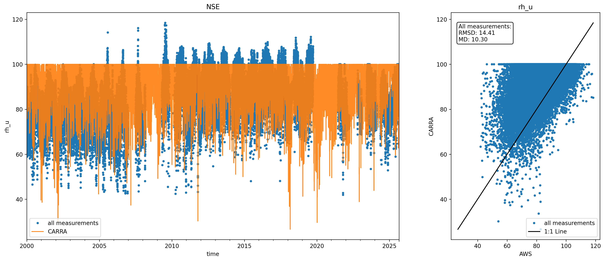
 
## rh_u_cor
no rh_u_cor in hour sites data
## wspd_u
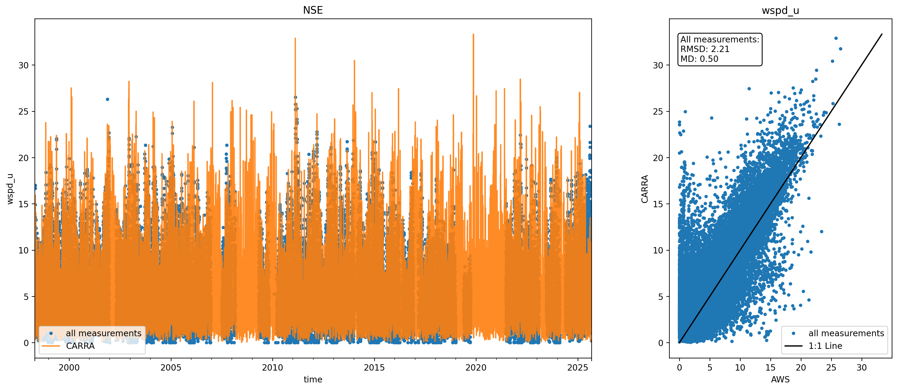
 
## dlr
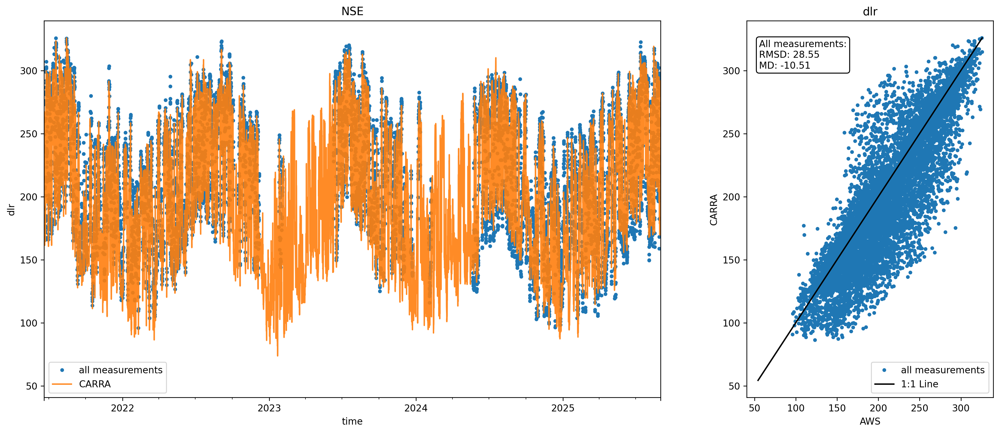
 
## t_surf
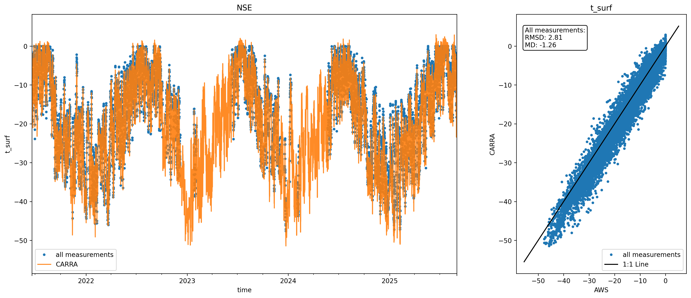
 
## p_u
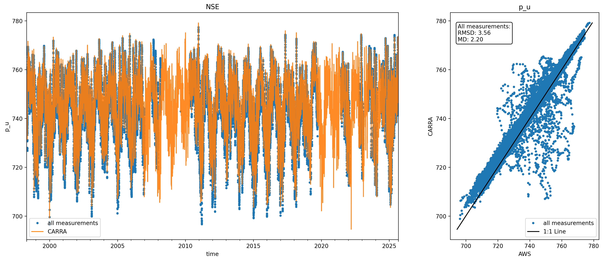
 
## qh_u
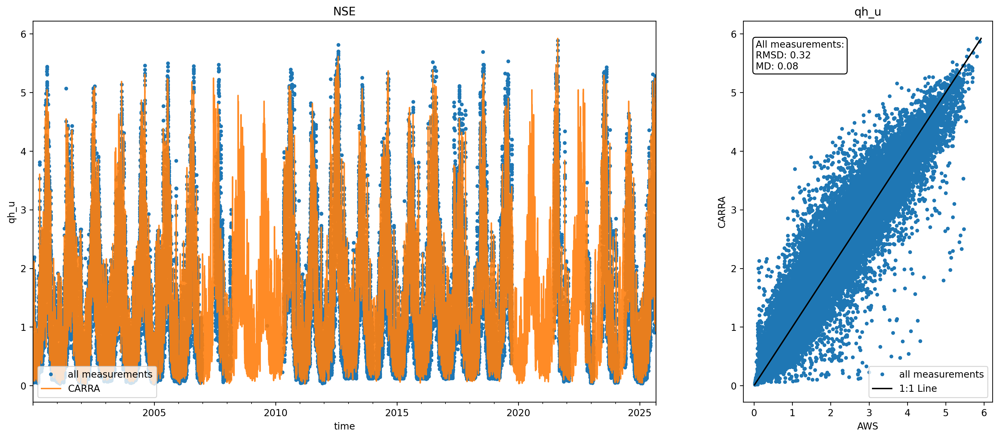
 
