# CEN
## rh_u
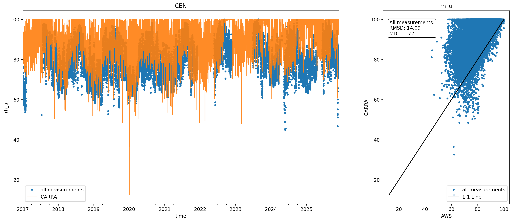
 
## rh_u_wrt_ice_or_water
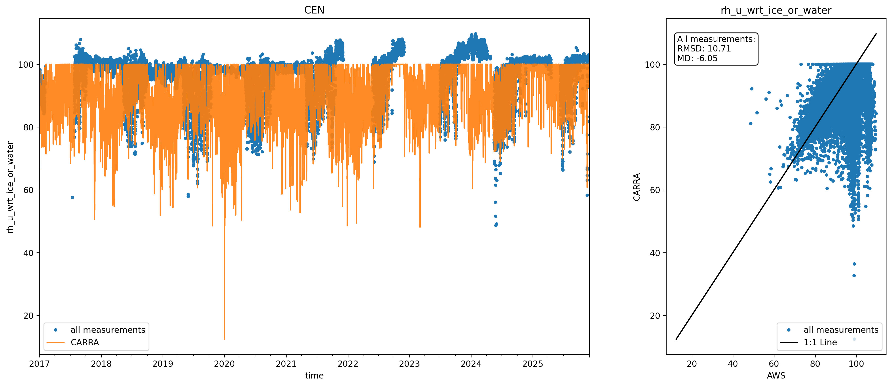
 
# CP1
## rh_u
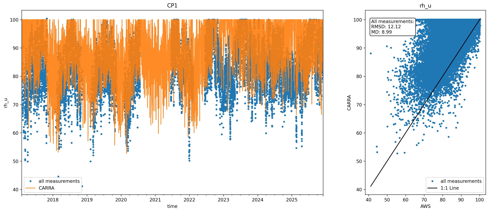
 
## rh_u_wrt_ice_or_water
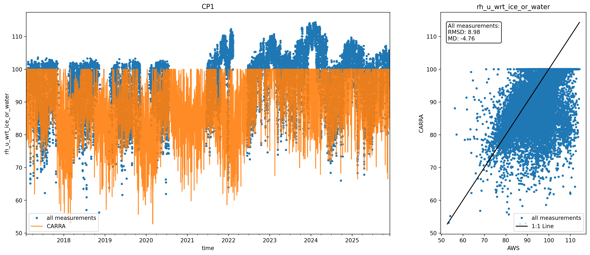
 
# DY2
## rh_u
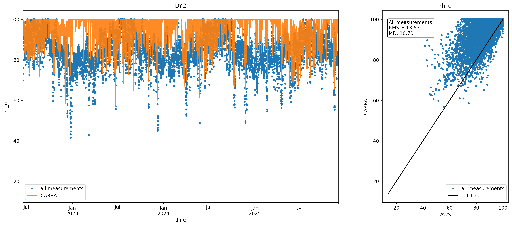
 
## rh_u_wrt_ice_or_water
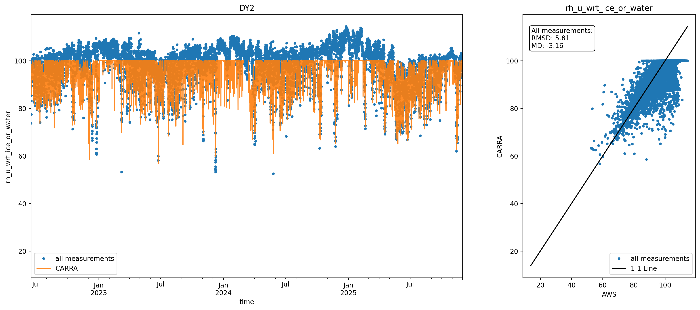
 
# EGP
## rh_u
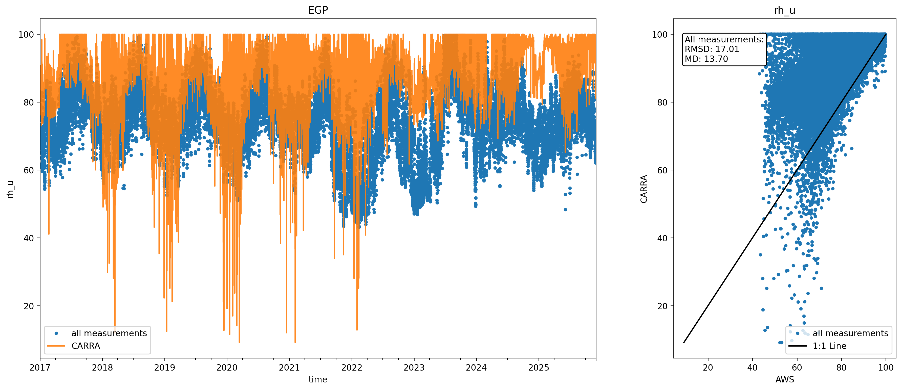
 
## rh_u_wrt_ice_or_water
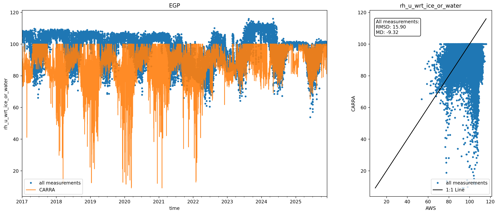
 
# HUM
## rh_u
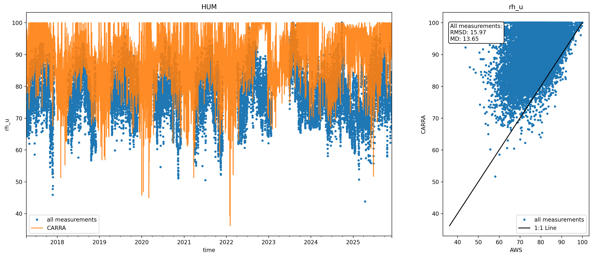
 
## rh_u_wrt_ice_or_water
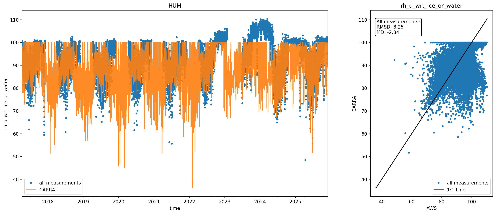
 
# JAR
## rh_u
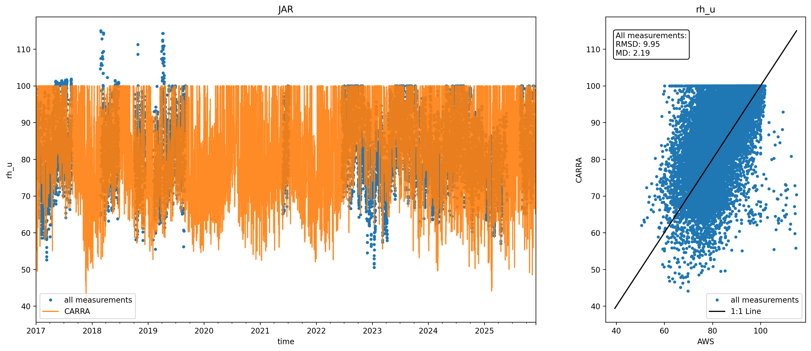
 
## rh_u_wrt_ice_or_water
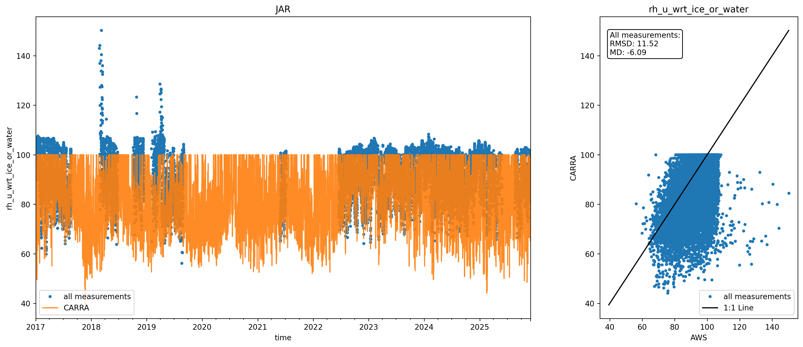
 
# JAR_O
