  * [CEN1](#s0-1)
  * [CEN2](#s0-2)
  * [CP1](#s0-3)
  * [DY2](#s0-4)
  * [EGP](#s0-5)
  * [FRE](#s0-6)
  * [HUM](#s0-7)
  * [JAR](#s0-8)
  * [JAR_O](#s0-9)
  * [KAN_B](#s0-10)
  * [KAN_L](#s0-11)
  * [KAN_Lv3](#s0-12)
  * [KAN_M](#s0-13)
  * [KAN_U](#s0-14)
  * [KPC_L](#s0-15)
  * [KPC_Lv3](#s0-16)
  * [KPC_U](#s0-17)
  * [KPC_Uv3](#s0-18)
  * [LYN_L](#s0-19)
  * [LYN_T](#s0-20)
  * [MIT](#s0-21)
  * [NAE](#s0-22)
  * [NAU](#s0-23)
  * [NEM](#s0-24)
  * [NSE](#s0-25)
  * [NUK_B](#s0-26)
  * [NUK_K](#s0-27)
  * [NUK_L](#s0-28)
  * [NUK_N](#s0-29)
  * [NUK_U](#s0-30)
  * [NUK_Uv3](#s0-31)
  * [QAS_A](#s0-32)
  * [QAS_L](#s0-33)
  * [QAS_Lv3](#s0-34)
  * [QAS_M](#s0-35)
  * [QAS_Mv3](#s0-36)
  * [QAS_U](#s0-37)
  * [QAS_Uv3](#s0-38)
  * [Roof_GEUS](#s0-39)
  * [Roof_PROMICE](#s0-40)
  * [SCO_L](#s0-41)
  * [SCO_U](#s0-42)
  * [SDL](#s0-43)
  * [SDM](#s0-44)
  * [SWC](#s0-45)
  * [SWC_O](#s0-46)
  * [TAS_A](#s0-47)
  * [TAS_L](#s0-48)
  * [TAS_U](#s0-49)
  * [THU_L](#s0-50)
  * [THU_L2](#s0-51)
  * [THU_U](#s0-52)
  * [THU_U2](#s0-53)
  * [TUN](#s0-54)
  * [UPE_L](#s0-55)
  * [UPE_U](#s0-56)
  * [UWN](#s0-57)
  * [WEG_B](#s0-58)
  * [WEG_L](#s0-59)
  * [ZAK_A](#s0-60)
  * [ZAK_L](#s0-61)
  * [ZAK_Lv3](#s0-62)
  * [ZAK_U](#s0-63)
  * [ZAK_Uv3](#s0-64)
## <a id='s0-1' />CEN1
AWS info:
77.181783, -61.11583, 1888.8
CARRA info:
77.181783, -61.11583, 1888.8

 
## <a id='s0-2' />CEN2
AWS info:
77.181944, -61.115725, 1895.8
CARRA info:
77.181974, -61.115571, 1892.2

 
## <a id='s0-3' />CP1
AWS info:
69.871594, -47.042033, 1947.4
CARRA info:
69.871905, -47.040122, 1946.2

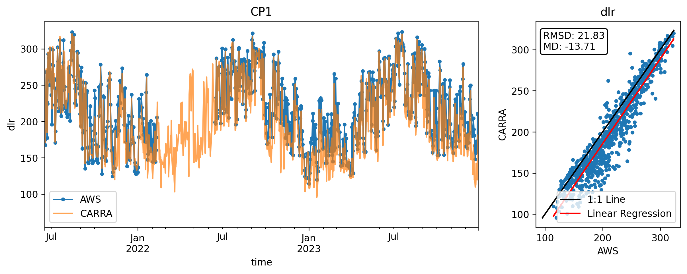

 
## <a id='s0-4' />DY2
AWS info:
66.482463, -46.294206, 2124.8
CARRA info:
66.482365, -46.293668, 2120.4

 
## <a id='s0-5' />EGP
AWS info:
75.627334, -35.968974, 2666.6
CARRA info:
75.626875, -35.969325, 2663.0

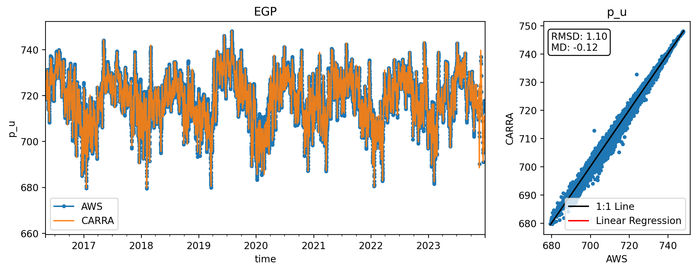

 
## <a id='s0-6' />FRE
AWS info:
74.38803, -20.833131, 684.7
error
 
## <a id='s0-7' />HUM
AWS info:
78.528993, -56.84485, 1970.0
CARRA info:
78.528905, -56.844485, 1969.3

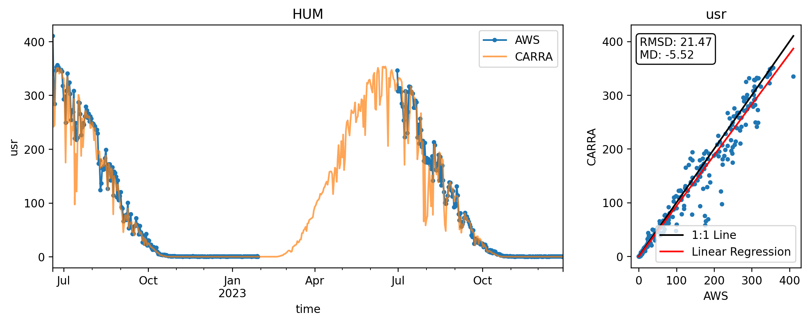
 
## <a id='s0-8' />JAR
AWS info:
69.492103, -49.72078, 907.7
CARRA info:
69.49211, -49.720732, 907.2

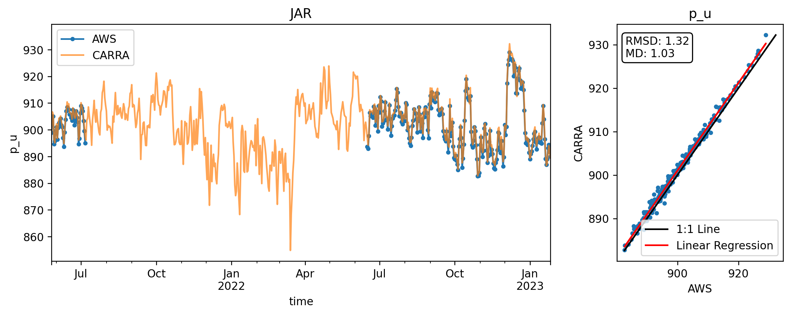

 
## <a id='s0-9' />JAR_O
AWS info:
69.494439, -49.67203, 927.6
CARRA info:
69.49468, -49.670705, 924.0
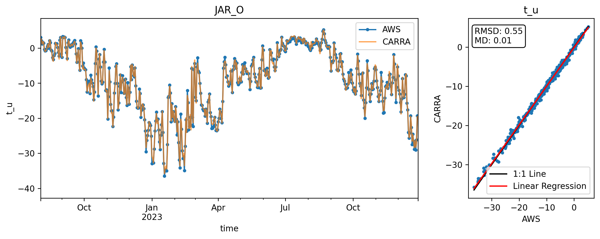

 
## <a id='s0-10' />KAN_B
AWS info:
67.1252, -50.1832, 350.0
error
 
## <a id='s0-11' />KAN_L
AWS info:
67.093486, -49.967557, 631.8
CARRA info:
67.093729, -49.9656, 631.4

 
## <a id='s0-12' />KAN_Lv3
AWS info:
67.105024, -49.930937, 685.8
error
 
## <a id='s0-13' />KAN_M
AWS info:
67.068168, -48.852014, 1271.0
CARRA info:
67.110979, -48.473568, 1270.0

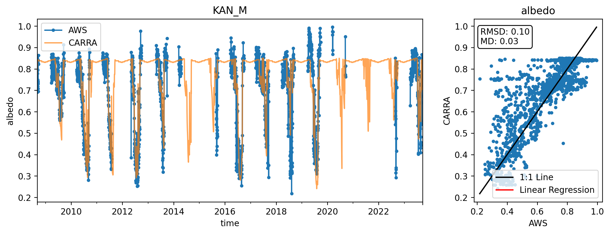

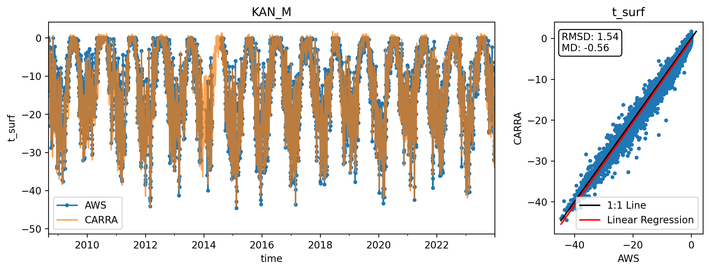

 
## <a id='s0-14' />KAN_U
AWS info:
67.000769, -47.034503, 1829.1
CARRA info:
67.000595, -47.032157, 1823.0

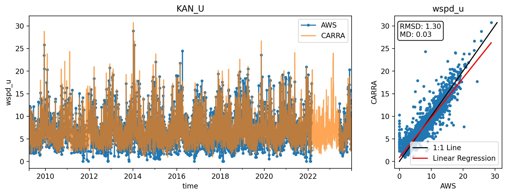

 
## <a id='s0-15' />KPC_L
AWS info:
79.910788, -24.080598, 360.9
CARRA info:
79.910799, -24.080779, 360.2

 
## <a id='s0-16' />KPC_Lv3
AWS info:
79.913878, -24.093317, 373.4
CARRA info:
79.913878, -24.093317, 373.4

 
## <a id='s0-17' />KPC_U
AWS info:
79.835112, -25.161635, 866.2
CARRA info:
79.835051, -25.162085, 864.4

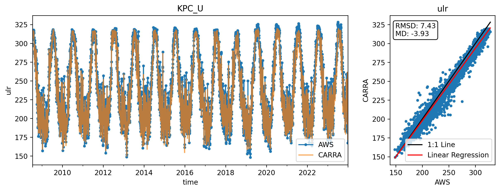

 
## <a id='s0-18' />KPC_Uv3
AWS info:
79.834922, -25.162375, 866.0
CARRA info:
79.83492, -25.162391, 865.8

 
## <a id='s0-19' />LYN_L
AWS info:
69.318938, -53.543717, 541.9
CARRA info:
69.318924, -53.543779, 538.8

 
## <a id='s0-20' />LYN_T
AWS info:
69.304273, -53.590195, 942.2
CARRA info:
69.304271, -53.590191, 940.0

 
## <a id='s0-21' />MIT
AWS info:
65.691955, -37.829808, 430.2
CARRA info:
65.69195, -37.829652, 425.1

 
## <a id='s0-22' />NAE
AWS info:
75.002552, -29.979465, 2626.6
CARRA info:
75.00244, -29.980349, 2626.2

 
## <a id='s0-23' />NAU
AWS info:
73.84059, -49.534398, 2337.7
CARRA info:
73.840482, -49.533584, 2337.1

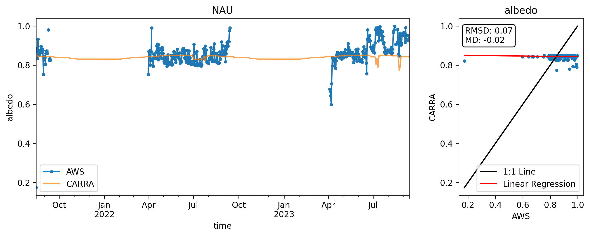

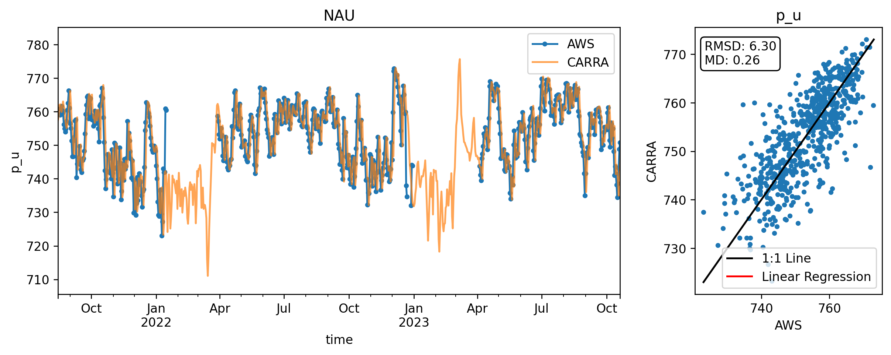

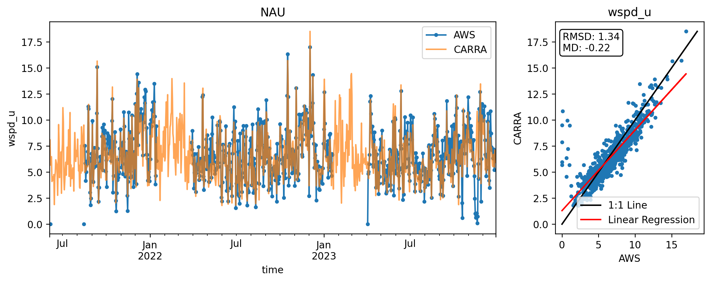

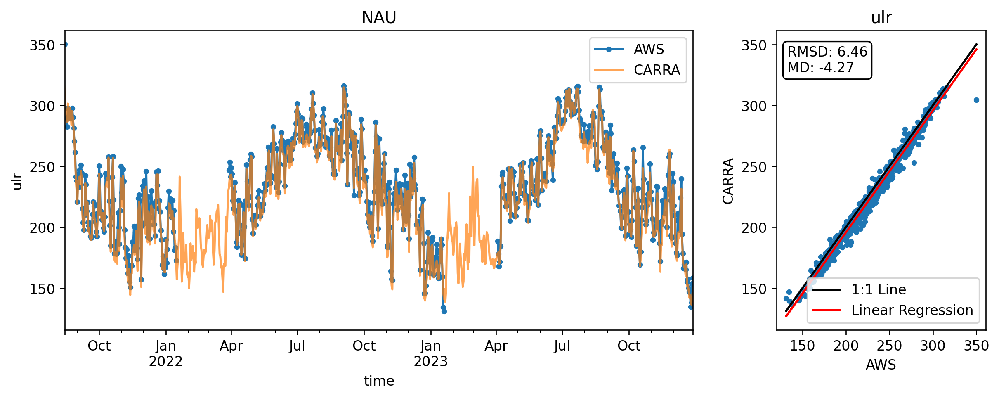

 
## <a id='s0-24' />NEM
AWS info:
77.441435, -51.083967, 2451.8
CARRA info:
77.441415, -51.083777, 2449.9

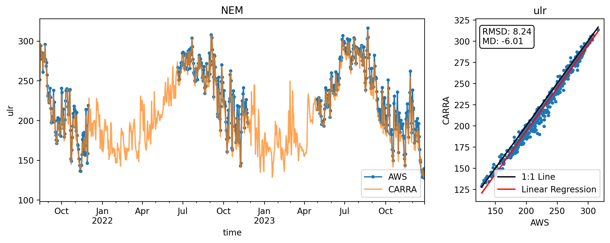

 
## <a id='s0-25' />NSE
AWS info:
66.477547, -42.493106, 2388.0
CARRA info:
66.477638, -42.493215, 2383.8

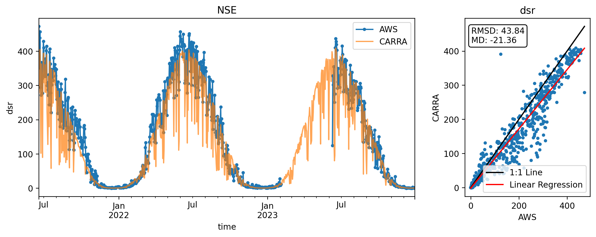

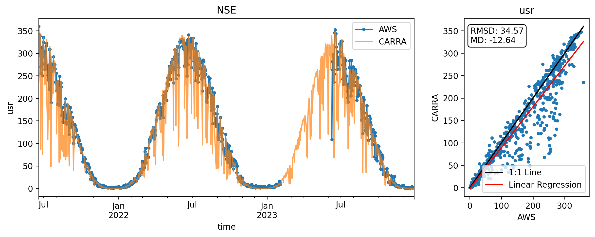
 
## <a id='s0-26' />NUK_B
AWS info:
64.461439, -50.152736, 108.8
error
 
## <a id='s0-27' />NUK_K
AWS info:
64.162291, -51.358682, 702.3
CARRA info:
64.162272, -51.358678, 697.4

 
## <a id='s0-28' />NUK_L
AWS info:
64.484174, -49.553143, 491.0
CARRA info:
64.483927, -49.551081, 497.6

 
## <a id='s0-29' />NUK_N
AWS info:
64.9452, -49.885, 920.0
error
 
## <a id='s0-30' />NUK_U
AWS info:
64.509097, -49.283506, 1115.0
CARRA info:
64.509369, -49.281127, 1123.0

 
## <a id='s0-31' />NUK_Uv3
AWS info:
64.509083, -49.285268, 1116.7
CARRA info:
64.509284, -49.283444, 1114.3

 
## <a id='s0-32' />QAS_A
AWS info:
61.243, -46.7328, 1000.0
error
 
## <a id='s0-33' />QAS_L
AWS info:
61.030442, -46.849768, 237.0
CARRA info:
61.030482, -46.849754, 240.9

 
## <a id='s0-34' />QAS_Lv3
AWS info:
61.030656, -46.849481, 240.1
error
 
## <a id='s0-35' />QAS_M
AWS info:
61.109911, -46.808667, 678.0
CARRA info:
61.109911, -46.808667, 678.0

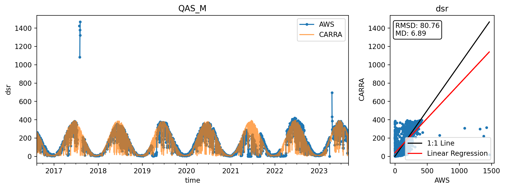

 
## <a id='s0-36' />QAS_Mv3
AWS info:
61.109912, -46.808349, 677.4
error
 
## <a id='s0-37' />QAS_U
AWS info:
61.172265, -46.822545, 885.1
CARRA info:
61.172571, -46.822218, 882.2

 
## <a id='s0-38' />QAS_Uv3
AWS info:
61.172262, -46.822504, 885.6
CARRA info:
61.172625, -46.82209, 886.2

 
## <a id='s0-39' />Roof_GEUS
AWS info:
55.688515, 12.582148, 29.4
error
 
## <a id='s0-40' />Roof_PROMICE
AWS info:
67.105041, 49.93069, 683.5
error
 
## <a id='s0-41' />SCO_L
AWS info:
nan, nan, nan
CARRA info:
72.232719, -26.936527, 470.0

 
## <a id='s0-42' />SCO_U
AWS info:
nan, nan, nan
CARRA info:
72.424926, -27.481842, 980.0

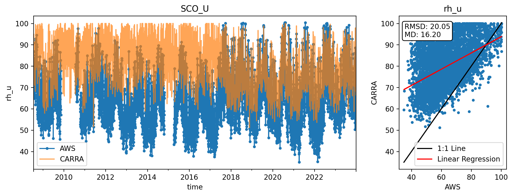

 
## <a id='s0-43' />SDL
AWS info:
66.000164, -44.50265, 2472.2
CARRA info:
66.000158, -44.502738, 2469.8

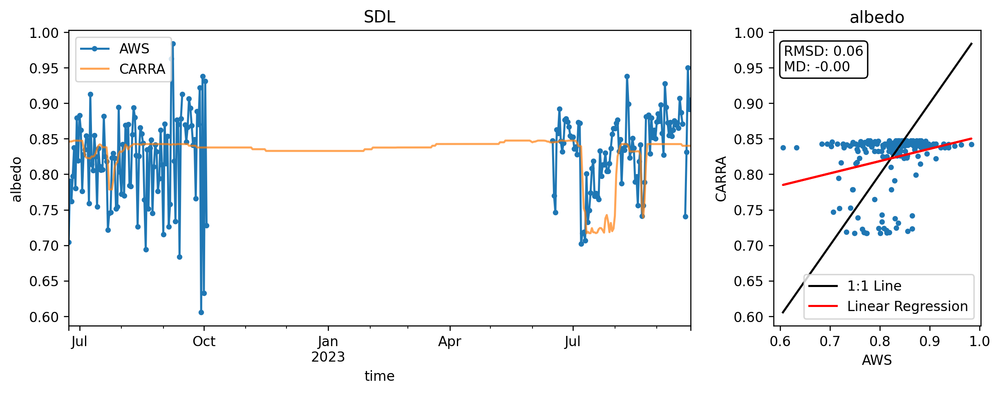

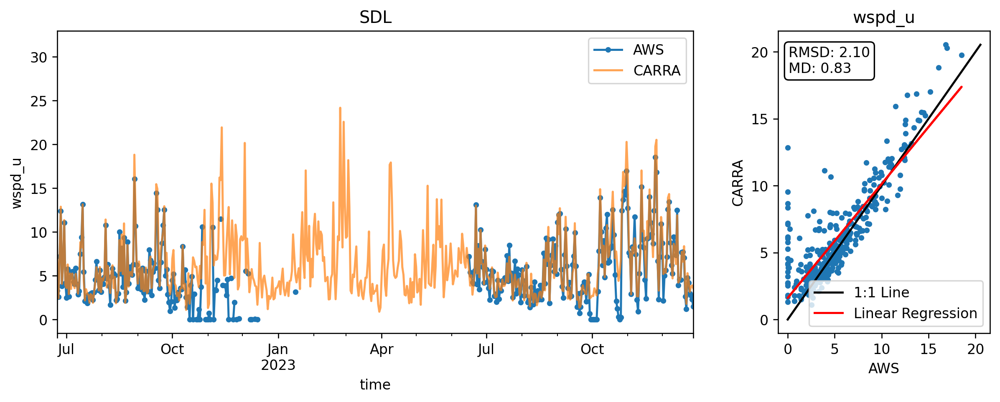

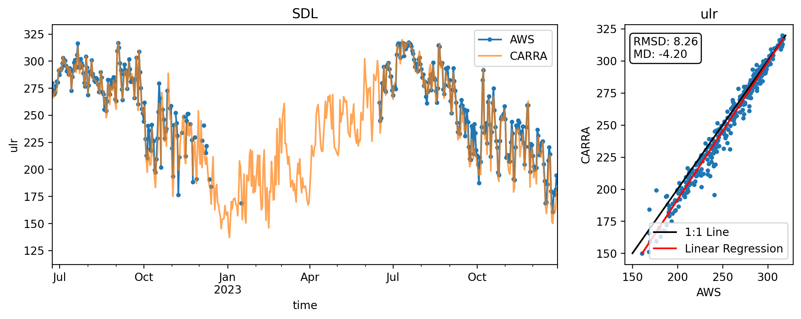

 
## <a id='s0-44' />SDM
AWS info:
63.148909, -44.817391, 2897.2
CARRA info:
63.148997, -44.817416, 2889.3

 
## <a id='s0-45' />SWC
AWS info:
69.552457, -49.37591, 1120.0
CARRA info:
69.552517, -49.375691, 1120.2

 
## <a id='s0-46' />SWC_O
AWS info:
69.594571, -49.282136, 1161.0
CARRA info:
69.595112, -49.280171, 1162.2

 
## <a id='s0-47' />TAS_A
AWS info:
65.774442, -38.890758, 880.3
CARRA info:
65.816324, -38.919422, 890.0

 
## <a id='s0-48' />TAS_L
AWS info:
65.639204, -38.899172, 233.1
CARRA info:
65.63932, -38.899118, 232.6

 
## <a id='s0-49' />TAS_U
AWS info:
65.6978, -38.8668, 570.0
error
 
## <a id='s0-50' />THU_L
AWS info:
76.399848, -68.267499, 561.8
CARRA info:
76.399846, -68.267375, 560.0

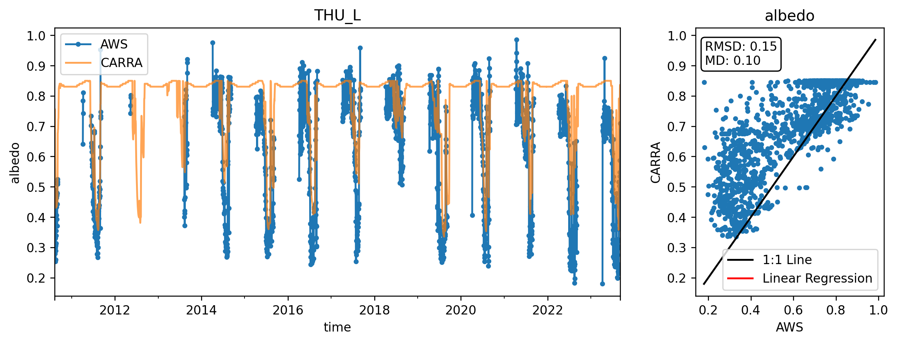

 
## <a id='s0-51' />THU_L2
AWS info:
76.393019, -68.265196, 572.2
CARRA info:
76.393024, -68.265118, 570.7

 
## <a id='s0-52' />THU_U
AWS info:
76.39303, -68.265081, 571.8
CARRA info:
76.39303, -68.26508, 571.8

 
## <a id='s0-53' />THU_U2
AWS info:
76.390204, -68.110534, 745.1
CARRA info:
76.390222, -68.110398, 737.8

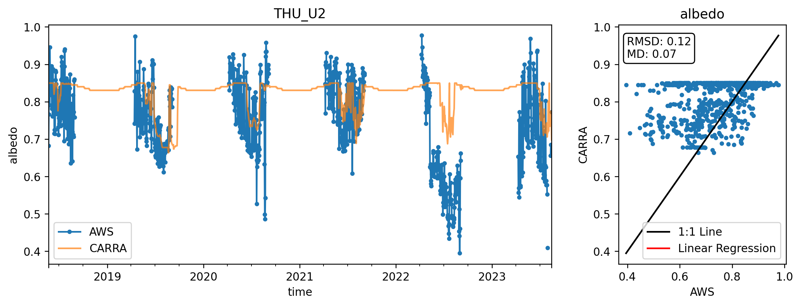

 
## <a id='s0-54' />TUN
AWS info:
78.019267, -33.961513, 2078.4
CARRA info:
78.019156, -33.962452, 2076.6

 
## <a id='s0-55' />UPE_L
AWS info:
72.893387, -54.295793, 201.7
CARRA info:
72.89337, -54.295845, 199.6
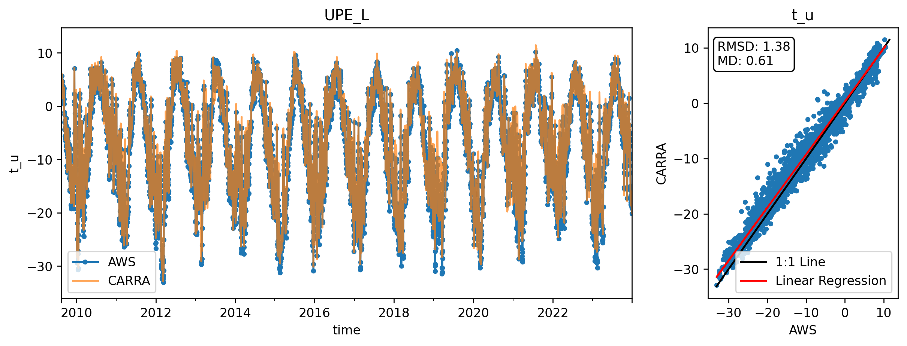

 
## <a id='s0-56' />UPE_U
AWS info:
72.885221, -53.617754, 912.1
CARRA info:
72.885451, -53.613616, 902.7

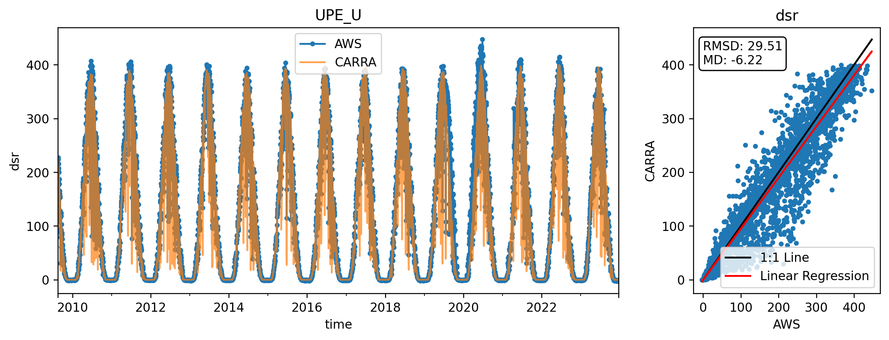

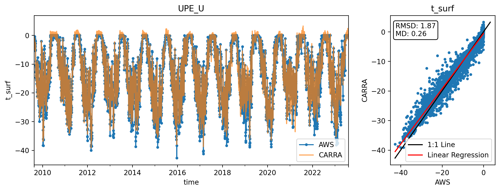

 
## <a id='s0-57' />UWN
AWS info:
61.685788, 7.198137, 554.8
error
 
## <a id='s0-58' />WEG_B
AWS info:
71.141458, -51.22205, 16.1
CARRA info:
71.141462, -51.222049, 11.6

 
## <a id='s0-59' />WEG_L
AWS info:
71.20499, -51.098404, 935.1
error
 
## <a id='s0-60' />ZAK_A
AWS info:
74.647558, -21.652047, 1484.8
error
 
## <a id='s0-61' />ZAK_L
AWS info:
74.709165, -30.219014, 685.7
CARRA info:
74.412643, -7.342256, 124.6

 
## <a id='s0-62' />ZAK_Lv3
AWS info:
74.624112, -21.374363, 628.9
error
 
## <a id='s0-63' />ZAK_U
AWS info:
74.624099, -21.374481, 630.4
CARRA info:
74.624099, -21.374481, 630.4

 
## <a id='s0-64' />ZAK_Uv3
AWS info:
74.64328, -21.461471, 862.4
CARRA info:
74.643352, -21.462085, 862.9

 
