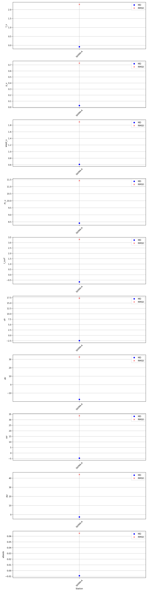
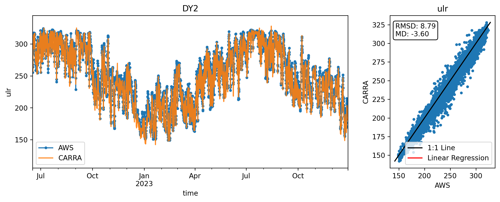
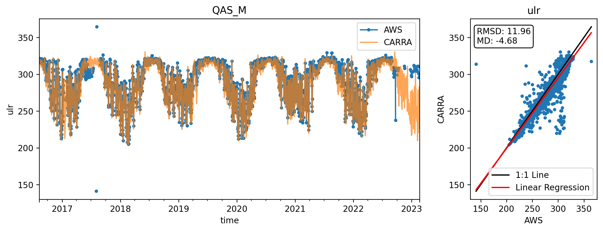
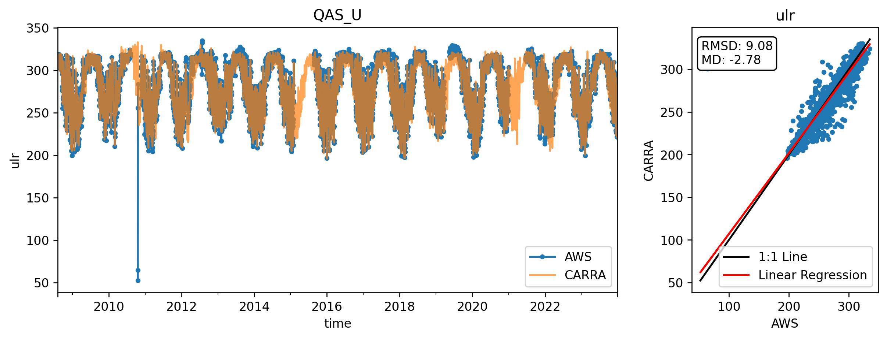

* [Stats plot](#s1)
* [Stats table](#s2)
* [ulr](#s3)
# <a id='s1' />Stats plot

# <a id='s2' />Stats table

| var   | station   |   latitude |   longitude |   elevation_aws |   elevation_CARRA | date_start   | date_end   |    ME |   RMSE |    N |
|:------|:----------|-----------:|------------:|----------------:|------------------:|:-------------|:-----------|------:|-------:|-----:|
| ulr   | CEN1      |    77.1826 |    -61.1127 |          1886   |          1881.31  | 2017-07-24   | 2023-10-31 | -2.48 |   7.42 | 1905 |
| ulr   | CP1       |    69.8725 |    -47.0364 |          1938.9 |          1949.94  | 2021-06-17   | 2023-10-31 | -3.9  |   5.7  |  744 |
| ulr   | DY2       |    66.4823 |    -46.2933 |          2125.1 |          2100.71  | 2022-06-16   | 2023-10-31 | -3.46 |   6.26 |  503 |
| ulr   | EGP       |    75.6    |    -35.9    |          2700   |          2672.54  | 2016-05-01   | 2023-10-31 | -4.68 |   8.35 | 2736 |
| ulr   | HUM       |    78.5288 |    -56.8442 |          1969.8 |          1957.15  | 2022-06-19   | 2023-10-31 | -4.46 |   6.43 |  349 |
| ulr   | JAR       |    69.4925 |    -49.7184 |           906.9 |           892.719 | 2021-05-26   | 2023-01-26 | -2.02 |   4.47 |  268 |
| ulr   | JAR_O     |    69.4948 |    -49.67   |           925.7 |           947.58  | 2022-08-03   | 2023-10-31 | -2.49 |   4.63 |  338 |
| ulr   | KAN_L     |    67.0957 |    -49.9485 |           680   |           660.441 | 2008-09-01   | 2023-10-31 | -5.29 |   7.68 | 5538 |
| ulr   | KAN_M     |    67.0667 |    -48.8327 |          1270   |          1263.8   | 2008-09-02   | 2023-10-31 | -2.87 |   5.89 | 5365 |
| ulr   | KAN_U     |    67.0003 |    -47.0243 |          1840   |          1845.64  | 2009-04-04   | 2023-10-31 | -3.66 |   7.26 | 5178 |
| ulr   | KPC_L     |    79.9108 |    -24.0832 |           370   |           408.182 | 2008-07-17   | 2023-10-31 |  0.18 |   6.85 | 4670 |
| ulr   | KPC_U     |    79.8345 |    -25.1665 |           870   |           868.038 | 2008-07-17   | 2023-10-31 | -3.94 |   7.32 | 5580 |
| ulr   | NAE       |    75.0024 |    -29.9806 |          2627.3 |          2603.21  | 2022-05-28   | 2023-10-31 | -7.42 |  10.74 |  183 |
| ulr   | NAU       |    73.8406 |    -49.5315 |          2340.4 |          2326.56  | 2021-08-15   | 2023-10-31 | -4.15 |   6.31 |  662 |
| ulr   | NEM       |    77.4414 |    -51.0837 |          2453.6 |          2447.82  | 2021-08-13   | 2023-10-31 | -5.62 |   7.82 |  454 |
| ulr   | NSE       |    66.4778 |    -42.4937 |          2386.5 |          2378.18  | 2021-06-19   | 2023-10-31 | -3.92 |   6.66 |  740 |
| ulr   | NUK_L     |    64.4822 |    -49.5325 |           540   |           421.762 | 2007-08-20   | 2023-10-31 |  1.32 |   5.69 | 5302 |
| ulr   | NUK_N     |    64.9452 |    -49.885  |           920   |           915.256 | 2010-07-25   | 2014-07-25 | -4.22 |  11.42 | 1372 |
| ulr   | NUK_U     |    64.511  |    -49.2663 |          1130   |          1128.81  | 2007-08-20   | 2023-10-31 | -3.82 |  10.07 | 4511 |
| ulr   | QAS_A     |    61.243  |    -46.7328 |          1000   |          1039.56  | 2012-08-20   | 2015-08-24 | -5.05 |   6.45 |  547 |
| ulr   | QAS_L     |    61.0308 |    -46.8488 |           280   |           312.628 | 2007-08-24   | 2023-10-31 | -1.75 |   5.38 | 5799 |
| ulr   | QAS_M     |    61.0999 |    -46.8329 |           626   |           661.174 | 2016-08-11   | 2023-02-20 | -4.68 |  11.96 | 2197 |
| ulr   | QAS_U     |    61.1758 |    -46.819  |           900   |           895.534 | 2008-08-07   | 2023-10-31 | -2.78 |   9.12 | 5018 |
| ulr   | SCO_L     |    72.224  |    -26.818  |           470   |          1046.82  | 2008-07-22   | 2023-10-31 |  0.97 |  13.56 | 5515 |
| ulr   | SCO_U     |    72.3937 |    -27.2383 |           980   |          1102.83  | 2008-07-21   | 2023-10-31 | -6.02 |  10.95 | 5129 |
| ulr   | SDL       |    66.0001 |    -44.5026 |          2458.4 |          2454.17  | 2022-06-23   | 2023-10-31 | -3.56 |   7.97 |  292 |
| ulr   | SDM       |    63.149  |    -44.8174 |          2896.1 |          2876.88  | 2021-06-21   | 2023-10-31 | -5.65 |   8.8  |  863 |
| ulr   | SWC       |    69.5542 |    -49.3693 |          1123   |          1108.76  | 2020-08-08   | 2023-02-14 | -2.67 |   4.46 |  921 |
| ulr   | SWC_O     |    69.5954 |    -49.2791 |          1167   |          1152.13  | 2022-08-02   | 2023-10-31 | -2.31 |   3.97 |  456 |
| ulr   | TAS_A     |    65.7797 |    -38.9008 |           890   |           854.375 | 2013-08-28   | 2023-10-09 | -0.26 |   9.64 | 2455 |
| ulr   | TAS_L     |    65.6403 |    -38.8987 |           260   |           282.096 | 2007-08-23   | 2023-10-31 |  2.29 |  16.81 | 3519 |
| ulr   | TAS_U     |    65.6978 |    -38.8668 |           570   |           485.667 | 2008-03-11   | 2015-08-13 |  2.48 |   5.48 | 2102 |
| ulr   | THU_L     |    76.3998 |    -68.2662 |           570   |           540.319 | 2010-08-09   | 2023-10-31 | -2.05 |   7.6  | 4000 |
| ulr   | THU_L2    |    76.3998 |    -68.2662 |           570   |           540.319 | 2022-05-16   | 2023-10-31 | -1.79 |   5.74 |  533 |
| ulr   | THU_U2    |    76.4197 |    -68.146  |           770   |           781.66  | 2018-05-22   | 2023-08-15 | -2.65 |   7.5  | 1905 |
| ulr   | TUN       |    78.0191 |    -33.963  |          2080   |          2067.86  | 2022-05-27   | 2023-10-31 | -4.22 |   6.66 |  440 |
| ulr   | UPE_L     |    72.8932 |    -54.2953 |           220   |           150.918 | 2009-08-17   | 2023-10-31 |  0.5  |   7.15 | 5177 |
| ulr   | UPE_U     |    72.8883 |    -53.5715 |           940   |           927.832 | 2009-08-18   | 2023-08-07 | -0.29 |   6.55 | 5077 |

# <a id='s3' />ulr

 
Skipping CEN2, already used in combination with CEN1

 

 

 

 

 

 

 

 

 

 
Skipping KPC_Lv3, already used in combination with KPC_L

 
Skipping KPC_Uv3, already used in combination with KPC_U

 

 

 

 

 

 

 
Skipping NUK_Uv3, already used in combination with NUK_U

 

 
Skipping QAS_Lv3, already used in combination with QAS_L

 

 
Skipping QAS_Uv3, already used in combination with QAS_U

 

 

 

 

 

 

 

 

 

 

 

 

 

 

 
