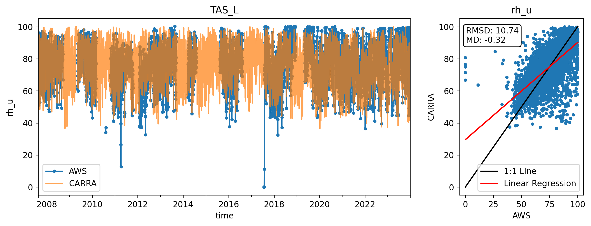

* [Stats plot](#s1)
* [rh_u](#s4)
* [rh_u_uncor](#s5)

# <a id='s1' />Stats plot

 
# <a id='s4' />rh_u

 
Skipping CEN2, already used in combination with CEN1

 

 

 

 

 

 

 

 

 

 
Skipping KPC_Lv3, already used in combination with KPC_L

 
Skipping KPC_Uv3, already used in combination with KPC_U

 

 

 

 

 
error
 

 
Skipping NUK_Uv3, already used in combination with NUK_U

error
 

 
Skipping QAS_Lv3, already used in combination with QAS_L

 

 
Skipping QAS_Uv3, already used in combination with QAS_U

 

 

 

 

 

 

 

 
error
 

 

 

 

 

 

 

 
# <a id='s5' />rh_u_uncor

 
Skipping CEN2, already used in combination with CEN1

 

 

 

 

 

 

 

 

 

 
Skipping KPC_Lv3, already used in combination with KPC_L

 
Skipping KPC_Uv3, already used in combination with KPC_U

 

 

 

 

 
error
 

 
Skipping NUK_Uv3, already used in combination with NUK_U

error
 

 
Skipping QAS_Lv3, already used in combination with QAS_L

 

 
Skipping QAS_Uv3, already used in combination with QAS_U

 

 

 

 

 

 

 

 
error
 

 

 

 

 

 

 

 